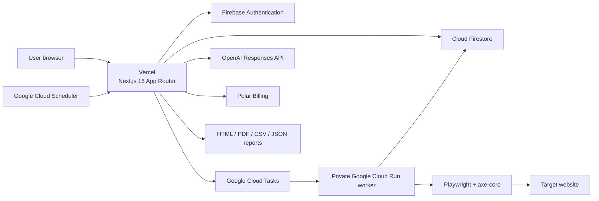
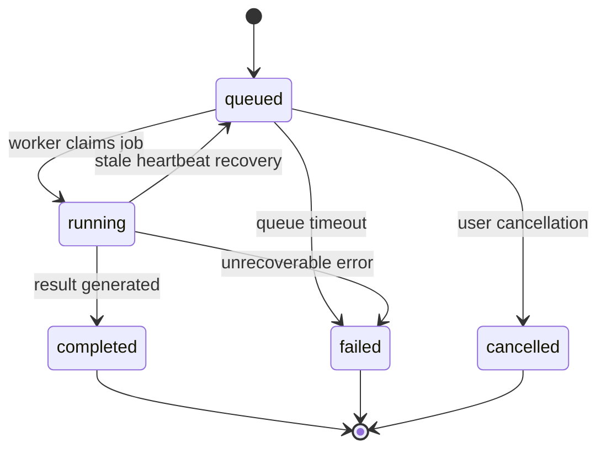

# Percevia AI — Project and Technical Scope Report

> **Review date:** June 23, 2026  
> **Reviewed version:** Current working tree on the `feat/scan-monitoring-foundation` branch  
> **Product name:** maitrico Percevia AI  
> **Report purpose:** Presentation preparation, technical architecture, product scope, and current-state assessment  
> **Evidence base:** Application code, API routes, worker code, Firestore model, tests, and operational documentation

## 1. Executive Summary

Percevia AI is a privacy-first accessibility operations platform that goes beyond detecting accessibility defects. It combines scanning, prioritization, team collaboration, remediation management, verification, reporting, and continuous monitoring in a single workspace.

The primary scan engine runs Playwright and axe-core inside real Chromium sessions. It analyzes desktop, tablet, and mobile viewports, as well as interactive states such as open menus, dialogs, accordions, tabs, and focused forms. Raw findings are normalized, recurring defects are grouped by root cause, severity and risk scores are calculated, and findings can be converted into trackable remediation tasks.

The product includes AI-assisted explanations, code suggestions, visual evidence, technical and executive reports, team roles, audit logs, retention and deletion controls, subscription management, and plan-based continuous scanning.

Percevia AI deliberately does not guarantee legal compliance or issue certifications. Automated results are treated as technical decision support and must be complemented by human review.

### 30-second presentation pitch

> Percevia AI turns web accessibility work from a one-time audit into a sustainable operational process. It detects issues with Playwright and axe-core in a real browser, combines repeated findings that share the same root cause, helps teams create remediation tasks, and converts results into technical or executive reports. AI explanations and visual evidence require explicit consent. The system does not guarantee legal compliance; it is designed to combine automated analysis with expert review.

## 2. The Problem the Project Solves

The central challenge in web accessibility is not merely finding defects. Teams commonly face the following problems:

- Hundreds of repetitive findings from different tools become unmanageable.
- Teams cannot easily determine which issues should be fixed first.
- Technical findings are difficult to explain to executives or clients.
- Remediation work is not tracked with owners, status, or due dates.
- Accessibility progress cannot be measured consistently between releases.
- The limitations of automated testing are not communicated accurately.
- Screenshots, AI processing, and scan data are not governed by clear privacy controls.
- Agencies, developers, auditors, and clients need different permissions over the same data.

Percevia AI addresses this by creating an operational cycle rather than presenting only a list of findings:

```text
Scan → Root-cause analysis → Prioritization → Assignment
     → Remediation → Re-scan → Comparison → Reporting
```

## 3. Core Value Proposition

Percevia AI connects accessibility scanning to the team's everyday workflow.

1. **Real-browser analysis:** The system evaluates a running page and its computed accessibility state rather than only downloaded HTML.
2. **Interactive-state testing:** Open menus, dialogs, tabs, accordions, and focus states are tested separately.
3. **Root-cause grouping:** Repeated defects caused by the same component are combined into one remediation target.
4. **Operational tracking:** Findings can be assigned statuses and converted into remediation tasks.
5. **Privacy-controlled AI:** AI processing is disabled by default and requires workspace consent.
6. **Privacy-controlled visual evidence:** Screenshot capture and storage require two levels of approval.
7. **Presentation-ready reporting:** Different report layers support technical teams, executives, and clients.
8. **Continuous monitoring:** Paid plans can schedule automatic recurring scans.
9. **Multi-user workspaces:** Roles, permissions, seat limits, and invitations are supported.
10. **Controlled compliance language:** Automated results are not presented as certification or a guarantee of legal conformity.

## 4. Product Scope and Current Status

| Module | Status | Description |
|---|---|---|
| Marketing and pricing pages | Implemented | Product messaging, plans, FAQ, and legal limitations |
| Firebase authentication | Implemented | Email-link and GitHub sign-in |
| Workspace and onboarding | Implemented | Company, standard, plan, and workspace setup |
| Single-page scanning | Implemented | Real-browser analysis of one URL |
| Multi-page scanning | Implemented | Same-origin link discovery up to a page limit |
| Sitemap scanning | Implemented | Default or user-provided sitemap |
| Manual URL list | Implemented | User-provided same-origin URL list |
| Desktop, tablet, and mobile scans | Implemented | Three fixed viewports |
| Interactive-state scanning | Implemented | Menu, dialog, accordion, tab, and form focus |
| Root-cause grouping | Implemented | Rule, selector, and contrast color-pair grouping |
| Scoring and risk classification | Implemented | Overall, category, and page scores |
| Finding status management | Implemented | Review, planned, in progress, fixed, accepted risk, and related states |
| Remediation tasks | Implemented | Create, update, delete, and project-based organization |
| Scan comparison | Implemented | Changes between historical scans |
| AI explanations and code suggestions | Configuration-dependent | Requires an OpenAI key and workspace consent |
| Visual evidence | Configuration-dependent | Requires workspace-level and scan-level consent |
| HTML, CSV, and JSON reports | Implemented | Generated on request |
| PDF reports | Implemented, environment-dependent | Server-side Chromium must be available |
| Public report sharing | Implemented | Revocable, token-based, and marked `noindex` |
| Team roles and invitations | Implemented | Firebase email link with manual-link fallback |
| Notification center | Implemented | Notifications and unread counts derived from audit logs |
| Privacy center | Implemented | AI, screenshots, retention, export, and deletion |
| Asynchronous data deletion | Implemented | Worker-executed and verified deletion job |
| Data-retention cron | Implemented | Automatic cleanup based on workspace policy |
| Polar subscription management | Configuration-dependent | Checkout, customer portal, and signed webhooks |
| Continuous monitoring | Implemented | Daily, every-three-days, or weekly recurring scans by plan |
| Monitoring email and Slack delivery | Incomplete | Channel and threshold data are stored, but messages are not sent |
| Enterprise SSO | Roadmap | SAML/OIDC is not implemented |
| Private or on-premises scanning | Roadmap | Listed as a future capability |
| Local scanning agent | Roadmap | Not part of the current production scope |

## 5. Target Users

### Product and project managers

- Make accessibility debt visible.
- Track critical issues and changes over time.
- Produce remediation roadmaps and executive reports.

### Software developers

- Inspect failing HTML, selectors, and axe rules.
- Review WCAG tags and affected pages.
- Receive AI-assisted code examples and verification steps.
- Update remediation task status.

### Accessibility specialists and auditors

- Evaluate automated findings.
- Separate false positives.
- Mark areas that require human review.
- Use manual review checklists alongside automated scans.

### Agencies

- Work across multiple client or project contexts.
- Produce branded client reports.
- Use restricted roles such as `client_viewer` and `report_viewer`.

### Executives and clients

- Review risk summaries and roadmaps without reading low-level technical details.
- Follow results through shareable report links.

### Privacy and compliance teams

- Manage AI processing, visual evidence, and retention settings.
- Export or delete workspace data.
- Review audit records and subprocessors.

## 6. Roles and Permissions

Supported roles:

| Role | Primary permission scope |
|---|---|
| `owner` | Full workspace, billing, privacy, team, and deletion control |
| `admin` | Scan, privacy, team, and remediation management, excluding billing |
| `developer` | Scan creation, AI access, and remediation management |
| `auditor` | Scan viewing, AI access, and report export |
| `client_viewer` | Read-only access to scans and remediation progress |
| `report_viewer` | Present in the data model with very limited application permissions |

The permission matrix separately controls:

- `create_scans`
- `view_scans`
- `view_ai`
- `export_reports`
- `manage_billing`
- `manage_privacy`
- `delete_scans`
- `manage_team`
- `manage_remediation`
- `view_remediation`

Default plan-based seat limits:

| Plan | Member limit |
|---|---:|
| Free | 1 |
| Starter | 3 |
| Agency | 10 |
| Team | 25 |
| Enterprise | 200 |

## 7. End-to-End User Journey

### 7.1 Product discovery and registration

Users review product capabilities, pricing, privacy positioning, and scan methodology on the public website. Authentication is handled by Firebase Authentication through email links or GitHub.

### 7.2 Workspace setup

During onboarding, the user configures:

- Workspace name
- Company information
- Target standard
- Region preference
- Plan
- Technical framework

The workspace is the primary data and authorization boundary.

### 7.3 Creating a scan

The user:

- Selects a scan type.
- Enters the primary URL.
- Sets a page limit.
- Confirms authorization to scan the website.
- Optionally enables AI explanations.
- Optionally enables visual evidence.

The API validates the URL, plan limits, daily quota, concurrent scan capacity, privacy consent, and worker configuration.

### 7.4 Asynchronous processing

Chromium does not run inside the scan creation request. A `queued` job is written to Firestore, and in production Cloud Tasks wakes the private Cloud Run worker.

The worker:

1. Atomically claims the job through a Firestore transaction.
2. Resolves target URLs for multi-page scans.
3. Creates page-level jobs.
4. Scans pages with Playwright and axe-core.
5. Writes progress and heartbeat information.
6. Persists results.
7. Aggregates the final scan summary after all pages reach a terminal state.

### 7.5 Reviewing results

Users can inspect:

- Overall score and risk level
- Critical, serious, moderate, minor, and review findings
- Page and category scores
- Root-cause groups
- Failed or partially scanned pages
- Visual evidence
- AI explanations

### 7.6 Remediation and verification

A finding can be converted directly into a remediation task. After the work is completed, a new scan can be compared with the previous result.

### 7.7 Reporting and sharing

Completed scans can produce executive, technical, or CSV-oriented reports. Reports are downloadable as HTML, PDF, CSV, or JSON, and authorized users can create token-based public links.

## 8. Current System Architecture



### Architecture layers

| Layer | Technology | Responsibility |
|---|---|---|
| Front end and API | Next.js 16.2.6, React 19.2.4, TypeScript | UI, Server Components, and API routes |
| Styling and design | Tailwind CSS 4, custom UI components | Responsive and accessible interface |
| Identity | Firebase Authentication | Email-link and GitHub authentication |
| Session | Firebase session cookie | HTTP-only server session |
| Data | Cloud Firestore | Workspaces, scans, findings, tasks, reports, and audit records |
| Queue | Google Cloud Tasks | Reliable and retryable worker activation |
| Scan worker | Google Cloud Run | Long-running Chromium processing |
| Browser engine | Playwright 1.60 and Chromium | Real-page execution and interaction |
| Accessibility engine | axe-core 4.11 | Automated accessibility rules |
| Scheduling | Cloud Scheduler and Vercel Cron | Recovery, monitoring, and retention |
| Artificial intelligence | OpenAI Responses API | Explanations, code suggestions, and project guidance |
| Billing | Polar | Checkout, portal, and subscription webhooks |
| Observability | Optional Sentry and PostHog adapters | Error reporting and product analytics |

## 9. Scan Processing Pipeline

Recommended production path:

```text
POST /api/scans
  └─ Firestore scans/{id}: status=queued
      └─ Cloud Tasks HTTP task
          └─ Private Cloud Run POST /process
              ├─ atomically claim scan
              ├─ resolve target URLs
              ├─ create pageJobs
              ├─ scan pages concurrently
              ├─ persist findings
              └─ aggregate final result
```

### Scan lifecycle



### Page-level job model

When `PAGE_JOBS_ENABLED` is enabled, every URL becomes an independent job. This provides several advantages:

- One slow page cannot block the entire scan.
- Page-level timeouts and retries can be applied.
- Failed pages are displayed separately.
- Results from healthy pages are preserved.
- Large scans can scale horizontally.
- Aggregation runs when the final page reaches a terminal state.

Scan phases:

- `crawling`
- `scanning`
- `aggregating`
- `completed`
- `completed_with_errors`
- `failed`

Page-job statuses:

- `queued`
- `running`
- `completed`
- `failed`

## 10. Scan Engine Technical Details

### 10.1 Scan types

| Type | Behavior |
|---|---|
| Single | Scans only the supplied URL |
| Multi | Discovers same-origin links up to the page limit |
| Sitemap | Scans same-origin URLs from a sitemap |
| Manual | Scans a user-provided same-origin URL list |

### 10.2 Viewport matrix

- Desktop: `1440 × 900`
- Tablet: `768 × 1024`
- Mobile: `390 × 844`

### 10.3 Interactive states

In addition to the initial state, each viewport attempts:

- Open menu
- Open dialog
- Open accordion
- Open tab
- Form focus

Up to two candidates are inspected for each interaction type. A page can therefore theoretically produce:

```text
3 viewports × (1 initial state + 5 interaction types × 2 candidates)
= up to 33 analysis variants
```

The real count can be lower depending on available components and the execution budget.

### 10.4 Resource-loading profiles

- `real`: Styles, fonts, and images load, making contrast and layout analysis more reliable.
- `minimal`: Some resources are blocked to reduce cost, but contrast and layout accuracy decrease.

The recommended production setting is `real`.

### 10.5 Security and execution limits

- Approximately 10 MB response limit per page
- Separate navigation and axe timeouts
- Hard limits at page and scan level
- Service workers blocked
- Origin validation for top-level navigation
- URL and DNS revalidation after redirects
- Chromium process health and memory monitoring

### 10.6 Static fallback

If Chromium cannot launch or real-browser analysis cannot complete, the system can fall back to a limited static HTML scan.

The fallback result:

- Is marked with low confidence.
- Does not contain visual evidence.
- Tells the user that real-browser analysis did not complete.
- Is not treated as equivalent to a Playwright and axe-core result.

## 11. URL Security and SSRF Protection

Because the scan system opens user-supplied URLs, SSRF protection is a critical security layer.

Implemented controls include:

- HTTP and HTTPS protocols only
- URL and hostname length limits
- Removal of URL usernames and passwords
- Removal of fragments
- Rejection of targets such as `localhost`, `.internal`, `.local`, `.corp`, and `.lan`
- Blocking private, loopback, link-local, and multicast IPv4 and IPv6 ranges
- Explicit blocking of the `169.254.169.254` metadata address
- Validation of every DNS resolution result
- DNS re-resolution in the worker to reduce rebinding risk
- Final URL validation after redirects
- Same-origin enforcement for manual and sitemap scans
- Explicit user confirmation that they are authorized to scan the target

## 12. Finding Normalization

Raw axe-core results are converted into the Percevia data model:

- Rule identifier
- Impact
- Product severity
- WCAG tags
- Description and help text
- Help URL
- CSS target
- Failing HTML sample
- Failure summary
- Viewport and interaction context
- Human-review requirement
- Visual-evidence metadata

Finding statuses:

- `to_review`
- `planned`
- `in_progress`
- `needs_human_review`
- `fixed`
- `accepted_risk`
- `false_positive`

Status changes are written to the audit log.

## 13. Root-Cause Grouping

axe-core can report the same underlying defect once for every DOM node and page. Percevia reduces this operational noise by grouping findings by root cause.

The default grouping key is:

```text
category + standard type + axe rule + normalized selector
```

Special cases:

- `color-contrast` defects can be grouped by shared foreground and background color pairs.
- Human-review findings are not merged with confirmed violations.
- WCAG and best-practice findings remain separate.
- Positional selector noise such as `nth-child` is removed.

Each group stores:

- Rule
- Title
- Worst severity
- Number of affected instances
- Primary WCAG tag
- Recommended remediation
- Priority score

## 14. Scoring System

The scoring version is persisted as `percevia-score-v1`.

Impact weights:

| Impact | Weight |
|---|---:|
| Critical | 10 |
| Serious | 6 |
| Moderate | 3 |
| Minor | 1 |
| Manual review | 2 |

Repeated findings use a logarithmic occurrence multiplier with an upper bound. The total penalty is normalized using the square root of the page count.

Generated outputs include:

- Overall score from 0 to 100
- A–F grade
- Low, medium, high, or critical risk
- Page scores
- Category scores
- WCAG finding count
- Best-practice finding count
- Manual-review count

Example categories:

- Color contrast
- ARIA
- Keyboard
- Forms
- Text alternatives
- Semantic structure
- Language
- Media
- Best practices

The score is not a legal compliance score. It supports prioritization and trend analysis between scans.

## 15. Visual Evidence

Visual evidence requires two levels of consent:

1. Visual evidence and screenshot storage must be enabled for the workspace.
2. The user must also select screenshots for the individual scan.

The system:

- Applies plan-based evidence limits.
- Stores selector, viewport, state, and bounding-box information.
- Attempts to redact sensitive regions.
- Assigns expiration dates.
- Allows the image data for individual evidence records to be deleted.
- Rejects images larger than 650 KB for persistence.

In V1, images are stored as Base64 inside Firestore rather than in external object storage. This simplifies the infrastructure but creates scaling constraints around document size and read cost.

## 16. Artificial Intelligence Layer

### Use cases

- Plain-language explanation of an individual finding
- Technical remediation summary
- Code example
- React, HTML, Shopify, or WordPress-oriented guidance
- Verification steps
- Client-friendly explanation
- Project assistant based on a selected scan

### Privacy rules

- AI must be explicitly enabled for the workspace.
- HTML samples are limited to 2 KB.
- Cookies are not sent.
- Form values are not sent.
- Screenshots are not sent.
- Only a bounded summary of the selected scan's findings, pages, and groups is used.
- User-based rate limiting is applied.
- The operation is written to the audit log.

### Output safety

The system prompt prohibits the model from:

- Guaranteeing legal compliance
- Issuing or implying certification
- Claiming that a website is fully or 100% compliant
- Recommending overlay products as substitutes for real remediation

Generated text is also post-processed to remove prohibited claims.

The default configured model is `gpt-5.3-codex`, which can be changed through an environment variable.

## 17. Remediation Management

A finding or root-cause group can be converted into a remediation task.

Task data includes:

- Title
- Description
- Status
- Priority
- Assigned member
- Due date
- Notes
- Scan, finding, and group relationships
- axe rule
- Severity
- Source URL
- Project key and label

Tasks can be organized by project or site domain, allowing one workspace to maintain separate remediation backlogs for different websites.

## 18. Reporting System

### Report types

- Full
- Executive
- CSV

### Selectable sections

- Executive summary
- Technical findings
- Page-level findings
- WCAG mapping
- Remediation roadmap
- Human-review checklist
- Scope and legal-limitation notice

The limitation notice is mandatory and cannot be removed from a report.

### Export formats

| Format | Capability |
|---|---|
| HTML | Portable and printable full report |
| PDF | A4 render of HTML through server-side Chromium |
| CSV | Row-level finding and group data |
| JSON | Structured report data |

PDF generation depends on the web application's Node.js environment being able to launch Playwright Chromium. If this fails, the API returns `pdf_unavailable`.

### Public sharing

- Uses a random 24-byte token.
- Can be revoked later.
- Returns responses with `no-store`.
- Sends `noindex, nofollow` to search engines.
- Requires report-export permission to create a share link.
- Agency, Team, and Enterprise plans can use workspace branding.

## 19. Accessibility Statement Module

The compliance center includes:

- Contact email or feedback link
- Known accessibility limitations
- Publishing toggle
- Live preview
- Turkish and English preview
- Embeddable badge HTML
- Public page at `/statement/{workspaceId}`

Although the module is functional, it should not be positioned as an official certification feature. Current phrases including “Verified Audit,” “partially conformant,” and “Verified by Percevia AI” conflict with the product's general no-certification and no-guarantee policy. User-controlled fields are also interpolated into public HTML without escaping, which must be treated as a security issue.

## 20. Continuous Monitoring

Continuous monitoring is gated by paid plans.

| Plan | Maximum monitors | Allowed frequency |
|---|---:|---|
| Free | 0 | None |
| Starter | 3 | Weekly |
| Agency | 25 | Daily, every three days, weekly |
| Team | 100 | Daily, every three days, weekly |
| Enterprise | 500 | Daily, every three days, weekly |

A monitor:

- Can be created from a URL or an existing scan.
- Stores scan type, page limit, and screenshot settings.
- Can be active or paused.
- Stores its next scheduled run.
- Tracks the latest scan as a comparison baseline.
- Stores thresholds for new critical findings and score drops.
- Stores email and Slack channel settings.

Cloud Scheduler checks the monitor endpoint every five minutes by default. Due monitors reuse the standard scan pipeline.

The current implementation completes scheduling and scan creation, but it does not yet contain a delivery layer that sends email or Slack messages when thresholds are met.

## 21. Subscription and Plan System

Plans:

- Free
- Starter
- Agency
- Team
- Enterprise

The plan affects:

- Daily scan count
- Maximum pages per scan
- Visual-evidence limit
- Team seats
- Available roles
- Continuous-monitoring capacity and frequency
- White-label reports

### Polar integration

Polar is used as the Merchant of Record:

- It hosts checkout.
- It provides the customer portal.
- Card data is not stored by the application.
- Subscription events are verified through signed webhooks.
- In production, only a verified webhook can assign a paid plan.
- Active and trialing subscriptions grant paid entitlement.
- Cancellation or entitlement loss returns the workspace to the Free plan.

When Polar is not configured, direct plan selection remains available for local development and demos.

### Default scan limits

| Plan | Daily scans | Pages per scan |
|---|---:|---:|
| Free | 3 | 3 |
| Starter | 50 | 50 |
| Agency | 200 | 200 |
| Team | 500 | 500 |
| Enterprise | 1000 | 1000 |

These values can be changed through environment variables.

## 22. Privacy and Data Management

Workspace-level settings include:

- AI processing consent
- Visual-evidence consent
- Screenshot-storage consent
- Visual-evidence retention period
- Scan-data retention period
- Region preference
- Accessibility-statement fields

### Data export

The JSON archive includes:

- Workspace
- Privacy settings
- Up to 500 scans
- Findings belonging to those scans
- Up to 500 remediation tasks
- Up to 500 reports
- Up to 500 audit records
- Export timestamp

### Deleting all scan data

Deletion is not completed synchronously inside one API request:

1. The user types `DELETE` as explicit confirmation.
2. The API creates a `DataDeletionJob` and returns `202 Accepted`.
3. Cloud Tasks wakes the worker.
4. The worker deletes scans, page jobs, pages, findings, groups, summaries, evidence, reports, and related tasks.
5. A final verification pass confirms zero remaining records.
6. Deleted counts and verification time are written to the job record.

### Data retention

Vercel Cron runs every day at 03:17 UTC and:

- Applies each workspace's `scanDataRetentionDays` policy.
- Removes expired visual evidence.

The endpoint fails closed in production when `CRON_SECRET` is missing.

## 23. Notifications and Audit System

Notifications are derived from audit records rather than stored in a separate message collection.

Examples include:

- Scan started or retried
- Finding status changed
- Remediation task created or updated
- Report created, exported, or shared
- AI explanation generated
- Team invitation created or accepted
- Privacy setting changed
- Data-deletion job completed
- Plan changed
- Scheduled scan started

The `notificationsSeenAt` field on workspace membership determines the unread count. When the user opens the notification panel, a POST request updates the seen timestamp.

## 24. Authentication and Team Invitations

Authentication includes:

- Firebase email-link sign-in
- GitHub provider
- Conversion of Firebase ID tokens into server session cookies
- Seven-day default session duration
- Fast cookie presence checks at the Edge proxy
- Full session and membership validation in API routes and Server Components

Team invitations:

- Validate the plan's permitted roles and remaining seat count.
- Create an expiring invitation token.
- Attempt delivery using Firebase Authentication email links from the client.
- Display a manual invitation link if delivery fails.
- Require the invited email account for acceptance.
- Can be revoked while pending.

The Team page still contains an outdated statement saying that email invitations are disabled, although Firebase email-link delivery is implemented.

## 25. Accessibility of the Percevia Interface

The Percevia interface includes:

- Skip-to-main-content link
- Semantic `main` region
- Keyboard focus handling
- Mobile bottom navigation
- Text-size preferences
- High-contrast preference
- Reduced-motion preference
- Browser-local preference persistence
- Appropriate `aria-label`, `aria-hidden`, `fieldset`, and radio patterns

These settings affect only the Percevia interface and do not modify scanned websites.

## 26. Core Data Model

Primary entities:

| Entity | Purpose |
|---|---|
| `User` | Application profile for a Firebase user |
| `Workspace` | Organization, plan, standard, and Polar linkage |
| `WorkspaceMember` | Role, status, and notification-seen timestamp |
| `UsageLimits` | Daily and monthly scan, page, and AI usage |
| `PrivacySettings` | AI, evidence, retention, region, and statement settings |
| `ScanJob` | Scan request, state, progress, heartbeat, and error information |
| `PageJob` | Independent page-scanning unit |
| `ScanPage` | Result for an individual URL |
| `AccessibilityIssue` | Normalized accessibility finding |
| `IssueGroup` | Findings sharing one root cause |
| `ScanSummary` | Score, risk, and category summary |
| `VisualEvidence` | Screenshot and redaction information |
| `RemediationTask` | Remediation work item |
| `Report` | Report configuration and share token |
| `Monitor` | Recurring scan schedule |
| `AuditLog` | Operational and sensitive-action record |
| `WorkspaceInvitation` | Expiring team invitation |
| `DataDeletionJob` | Asynchronous data-deletion process |

Firestore uses workspace subcollections to provide tenant separation. Some global collections include:

- `auditLogs`
- `visualEvidence`
- `publicReportShares`
- `workspaceInvitations`
- `dataDeletionJobs`
- `rateLimits`
- `workerHeartbeats`
- `systemUsage`

## 27. API Surface

### Identity and workspace

- `POST/DELETE /api/auth/session`
- `PATCH /api/me`
- `PATCH /api/workspace`

### Scanning

- `GET/POST /api/scans`
- `GET/DELETE /api/scans/[id]`
- `GET /api/scans/[id]/status`
- `GET /api/scans/[id]/issues`
- `POST /api/scans/[id]/retry`
- `GET /api/scans/[id]/compare`

### Worker and operations

- `POST /api/internal/scans/process`
- `GET/POST /api/internal/scans/sweep`
- `GET/POST /api/internal/monitors/run`
- `GET/POST /api/cron/data-retention`
- `GET /api/healthz`

### Findings and AI

- `GET/PATCH /api/issues/[id]`
- `POST /api/issues/[id]/ai-explanation`
- `GET /api/issues/[id]/visual-evidence`
- `POST /api/ai-assistant`

### Remediation

- `GET/POST /api/remediation-tasks`
- `PATCH/DELETE /api/remediation-tasks/[id]`

### Reports

- `GET/POST /api/reports`
- `GET /api/reports/[id]`
- `GET /api/reports/[id]/export`
- `POST /api/reports/[id]/share`
- `GET /r/[token]`

### Continuous monitoring

- `GET/POST /api/monitors`
- `GET/PATCH/DELETE /api/monitors/[id]`

### Team

- `GET/POST /api/team/invitations`
- `DELETE /api/team/invitations/[id]`
- `POST /api/team/invitations/[id]/accept`

### Privacy

- `GET/PATCH /api/privacy/settings`
- `GET /api/privacy/audit-logs`
- `GET /api/privacy/export-workspace-data`
- `GET/POST /api/privacy/delete-scan-data`
- `GET/DELETE /api/visual-evidence/[id]`
- `GET /api/visual-evidence/[id]/image`

### Billing

- `POST /api/billing/checkout`
- `GET /api/billing/portal`
- `POST /api/billing/webhook`
- `POST /api/plan/select`

### Notifications and statements

- `GET/POST /api/notifications`
- `GET /statement/[id]`

## 28. Security Approach

Primary security controls:

- HTTP-only Firebase session cookie
- Server-side token verification
- Active workspace membership checks
- Role and permission matrix
- Zod API input validation
- SSRF protection and post-redirect validation
- Same-origin restrictions
- Explicit scan authorization confirmation
- Atomic job claims through Firestore transactions
- Private Cloud Run service invoked through OIDC
- Shared secret on the worker endpoint
- Bearer secret on Scheduler endpoints
- Polar webhook signature verification
- Cryptographic report-sharing token
- Firestore-backed distributed rate limiting
- Audit logs
- AI data minimization and output sanitization
- Visual-evidence redaction and automatic expiry
- SOPS and age for encrypted local secrets
- Cloud Run Application Default Credentials
- Secret Manager for the worker secret
- Non-root `pwuser` account inside the worker container

Rate-limit examples:

| Operation | Default limit |
|---|---:|
| Scan creation | 10 per minute |
| AI explanation | 60 per hour |
| Report export | 30 per hour |
| Visual-evidence access | 120 per hour |

Rate limiting fails open when Firestore is unavailable to preserve API availability.

## 29. Resilience and Scalability

### Atomic claims

Even when multiple workers see the same job, a Firestore transaction ensures that only one worker owns it.

### Heartbeats and sweeper

- Worker heartbeat: 15 seconds by default
- Page-job heartbeat: 20 seconds by default
- Stale page threshold: 90 seconds by default
- Queue timeout: 30 minutes by default
- Overall page-job scan cap: 15 minutes by default
- Reclaim limit: 3 by default

Cloud Scheduler runs the sweeper every two minutes:

- Requeues frozen jobs.
- Fails jobs that exceed their limits.
- Restarts incomplete aggregation.
- Re-enqueues Cloud Tasks when claimable work remains.

### Chromium lifecycle

- One Chromium process per worker process
- Isolated browser context for each page
- Two concurrent contexts by default
- Recommended concurrency of 2 for a 2 GB Cloud Run instance
- Default recycle threshold of 1536 MB RSS
- Browser recycling after 50 jobs by default
- Exponential-backoff relaunch after Chromium crashes
- `/health` returns 503 and the process exits if relaunch is exhausted

### Scale-to-zero

Cloud Run scales to zero while idle. The first scan after an idle period may experience a 10–30 second cold start. The asynchronous queue prevents this delay from blocking the original user request.

## 30. Deployment Architecture

### Web application

- Vercel
- Node.js 22.x
- Next.js App Router
- Production secrets stored in Vercel Environment Variables

### Scan worker

- Google Cloud Run
- Official Playwright container base with Chromium
- Recommended baseline of 1 CPU and 2 GiB memory
- Minimum 0 and default maximum 5 instances
- Private service with unauthenticated access disabled

### Queue and scheduling

- Cloud Tasks queue
- Cloud Scheduler scan-sweep job every two minutes by default
- Cloud Scheduler monitor job every five minutes by default
- Vercel data-retention cron every day at 03:17 UTC

### Google Cloud IAM

- Worker runtime identity: Firestore access
- Task creator identity: Cloud Tasks Enqueuer
- Task invoker identity: Cloud Run Invoker
- Worker shared secret: Secret Manager

### Firestore operations

- Required composite indexes can be installed by the deployment script.
- TTL policy for `rateLimits.expireAt`
- TTL policy for `workerHeartbeats.expireAt`

## 31. Test and Quality Status

Checks run on June 23, 2026:

| Check | Result |
|---|---|
| `npm test` | Passed |
| Test files | 52 passed, 1 skipped |
| Tests | 323 passed, 4 skipped |
| `npm run typecheck` | Passed |
| `npm run worker:typecheck` | Passed |
| `npm run lint` | Failed: 6 errors and 2 warnings |
| End-to-end tests | Not run during this review |
| Live production smoke test | Not run during this review |

The codebase contains approximately:

- 37,300 lines of TypeScript and TSX
- 53 Vitest test files
- 327 unit and integration test cases
- Marketing, mocked, and Firebase-authenticated Playwright E2E flows

Major tested areas include:

- URL validation and SSRF protection
- axe result normalization
- Root-cause grouping
- Scoring
- Scan-source resolution
- Viewport and interaction variants
- Worker lifecycle
- Page jobs
- Heartbeats and sweeper behavior
- Scan APIs
- Firestore index error handling
- Privacy deletion and export
- Data-retention cron
- Report rendering and export
- Polar checkout and webhooks
- Plan entitlements
- Monitor scheduling
- AI output
- Notifications
- Team invitations

Current lint failures are mainly caused by synchronous state updates inside effects and explicit `any` usage in the accessibility-statement client and manual-review checklist.

## 32. Strengths

- Correct separation between the web layer and the Chromium worker
- Low-traffic scale-to-zero cost model through Cloud Tasks and Cloud Run
- Page-level jobs prevent one page from blocking the entire scan
- Combined heartbeat, timeout, retry, and sweeper layers
- Detailed and defensive URL security
- AI and screenshots disabled by default
- Root-cause grouping reduces operational noise
- Findings are connected to a task and status lifecycle
- Report limitation notices are mandatory
- Polar webhooks are the only trusted paid-plan writer in production
- Asynchronous and verified data deletion
- Audit logs are reused for notifications and compliance visibility
- Tests cover both pure logic and route or worker behavior
- Accessibility preferences are available in the product's own interface

## 33. Open Issues and Technical Risks

### P0 — Accessibility statement security and claims risk

The public statement HTML places user-controlled company name, limitations, and contact fields into HTML without escaping. This can become a stored cross-site scripting risk.

The same module includes phrases such as:

- “Verified Audit”
- “partially conformant”
- “Verified by Percevia AI”
- “Being honest protects you legally”

These claims conflict with the product's no-guarantee position. The presentation should describe this feature as a draft statement generator rather than a certification or verification product.

### P1 — Lint quality gate is failing

The code passes TypeScript checks and tests, but lint fails with six errors. If lint is mandatory in continuous integration, it can block deployment.

### P1 — Monitor alert delivery is incomplete

The Monitor model stores email, Slack, and threshold settings, and the scheduler creates scans. However, no layer compares results and sends actual email or Slack alerts.

### P1 — PDF generation depends on the serverless runtime

PDF reports are generated by launching Playwright Chromium inside the web application. If the Vercel runtime lacks a compatible browser binary or exceeds size or duration limits, PDF export can return 503. Moving PDF generation to the worker would be more reliable.

### P2 — Base64 image storage in Firestore

The 650 KB cap reduces immediate risk, but object storage such as Cloud Storage would be better for a high volume of evidence.

### P2 — Region preference is not physical data residency

Changing `regionPreference` in the UI does not automatically move Firebase or Cloud Run resources. Actual data location depends on deployment configuration.

### P2 — Documentation and interface inconsistencies

- The production-readiness document says billing is disabled, while Polar billing is implemented.
- The Team page says email invitations are disabled, while Firebase email-link delivery exists.
- Some deployment text still uses the AccessOps brand.
- The `.env.example` heading still mentions Cloudflare.

### P2 — Legacy branding

The deployment script and Artifact Registry defaults still contain `AccessOps` names. These are mainly operational rather than user-facing, but they should be aligned with the Percevia brand.

### P3 — Fail-open rate limiting

Requests are allowed when Firestore rate-limit access fails. This is an intentional availability decision, but platform-level rate limiting or a web application firewall should provide an additional abuse-control layer.

## 34. Recommended Roadmap

### Short term

1. Escape all dynamic fields in the public accessibility-statement route.
2. Remove “Verified,” “partially conformant,” and legal-protection language.
3. Resolve lint errors and add a CI quality gate.
4. Add monitor result comparison and alert generation.
5. Remove outdated AccessOps, Cloudflare, and billing-disabled text.
6. Move PDF generation to the Cloud Run worker.

### Medium term

1. Move visual evidence to Cloud Storage.
2. Add monitor history and trend charts.
3. Implement email and Slack notification delivery.
4. Expand report templates by brand and language.
5. Connect usage and billing metrics more deeply with Polar.
6. Run authenticated E2E tests against a staging Firebase project in CI.

### Long term

1. Enterprise SSO
2. Dedicated regions and data residency
3. On-premises or private-network scanning agent
4. Large-scale asset inventory and project hierarchy
5. Advanced trend, SLA, and regression analysis
6. Jira, Linear, GitHub, and GitLab task integrations

## 35. Recommended Presentation Structure

### Slide 1 — What is Percevia AI?

Core message:

> A privacy-first SaaS platform that turns accessibility scanning into a sustainable team operation.

### Slide 2 — The problem

- Repetitive and unmanageable findings
- Lack of prioritization
- Difficulty translating technical results into business language
- Remediation work that cannot be tracked
- One-time audits that fail to detect regressions

### Slide 3 — Product approach

```text
Detect → Group → Prioritize → Assign → Fix → Re-scan → Report
```

### Slide 4 — Main capabilities

- Real-browser scanning
- Three viewports and interactive states
- Root-cause grouping
- Remediation tasks
- AI explanations
- Visual evidence
- Reporting
- Continuous monitoring

### Slide 5 — Users

- Developer
- Auditor
- Product manager
- Agency
- Client or executive
- Privacy lead

### Slide 6 — End-to-end flow

Show scan creation, worker processing, results, remediation, and re-scanning.

### Slide 7 — Technical architecture

Use the diagram showing Vercel, Firebase, Cloud Tasks, Cloud Run, Playwright, axe-core, OpenAI, and Polar.

### Slide 8 — Scan engine

- Three viewports
- Up to 33 analysis variants
- SSRF validation after redirects
- Page-level timeouts and retries
- Static fallback

### Slide 9 — From findings to action

Raw axe record → normalized finding → root-cause group → priority → task.

### Slide 10 — Privacy and trust

- AI disabled by default
- Two-level screenshot consent
- Data minimization
- Redaction
- Retention and deletion
- Audit logs
- No legal guarantee

### Slide 11 — Continuous monitoring and commercial model

- Plan-based monitor capacity
- Polar subscriptions
- White-label reports
- Team seats

### Slide 12 — Quality and resilience

- 323 passing tests
- Passing TypeScript checks
- Cloud Tasks retries
- Worker heartbeats
- Sweeper and aggregation recovery
- Browser recycling and health checks

### Slide 13 — Current risks

- Accessibility-statement language and XSS risk
- Lint errors
- Missing monitor alert delivery
- PDF runtime dependency
- Firestore Base64 evidence scaling limit

### Slide 14 — Roadmap

Present short-, medium-, and long-term work in three columns.

### Slide 15 — Closing message

> Percevia AI's value is not merely finding more defects. It makes accessibility work measurable, trackable, and repeatable.

## 36. Short Answers to Likely Presentation Questions

### Does the product issue WCAG certification?

No. It helps manage automated and manual review workflows but does not issue certification or guarantee legal compliance.

### Why does it use axe-core?

axe-core is widely adopted, developer-friendly, and can run in a real browser context through Playwright.

### Why does scanning not run inside Vercel?

Chromium scans are long-running, memory-intensive, and sensitive to serverless execution limits. The user application therefore runs on Vercel while the scan engine runs in a Cloud Run container.

### Is a scan lost if a worker crashes?

No. The job remains in Firestore. A job with a stale heartbeat is requeued by the sweeper or moved to a clear failure state after its retry limit is exhausted.

### What data does AI receive?

It receives the rule, description, WCAG tags, a limited HTML sample, and a bounded summary of the selected scan. Cookies, form values, and screenshots are not sent.

### Is visual evidence enabled by default?

No. It requires both workspace-level consent and a separate choice by the user starting the scan.

### Can the system scale to large websites?

Page-level jobs and multiple Cloud Run instances support horizontal scaling. However, Base64 evidence storage in Firestore and current default quotas should be redesigned for very high volume.

### Does continuous monitoring send alerts?

Scheduled scan creation is implemented. Email and Slack channel settings are stored, but actual alert delivery is not yet complete.

## 37. Conclusion

The Percevia AI codebase is beyond a basic prototype. It includes real-browser scanning, secure URL validation, page-level processing, root-cause grouping, scoring, remediation management, AI guidance, visual evidence, report sharing, team roles, a privacy center, data deletion, Polar subscriptions, and recurring-monitor scheduling.

Its strongest architectural decision is the separation between the user-facing Next.js application and the Chromium-heavy worker. Cloud Tasks, a private Cloud Run worker, Firestore transactions, heartbeats, and the sweeper together create a processing pipeline that is economical at low traffic and recoverable during failures.

The most important steps toward stronger production maturity are resolving the accessibility-statement security and claims risks, restoring a passing lint quality gate, completing monitor alert delivery, and moving PDF and image storage workloads to more suitable infrastructure.

The central presentation message should be:

> Percevia AI goes beyond finding accessibility issues. It enables teams to understand, prioritize, remediate, verify, and safely communicate accessibility work through one end-to-end operations platform.
