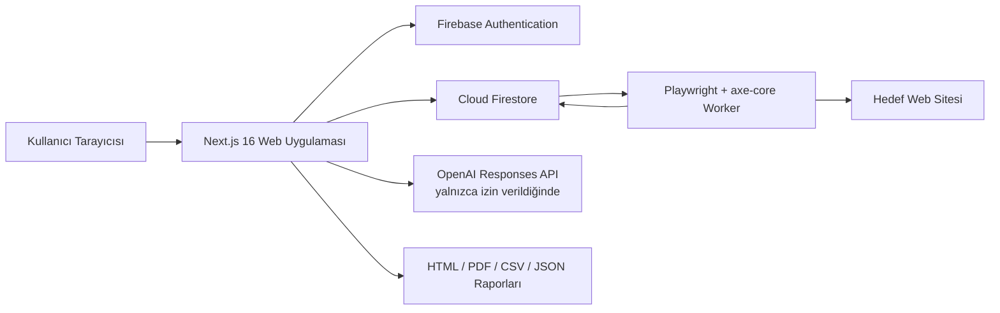

# Percevia AI Proje Anlatımı

> İnceleme tarihi: 13 Haziran 2026  
> İncelenen kaynak: Mevcut uygulama kodu, API rotaları, worker, testler ve proje belgeleri  
> Ürün adı: **maitrico Percevia AI**

## Mini Proje Paragrafı

**Percevia AI; web sitelerindeki erişilebilirlik sorunlarını gerçek tarayıcı üzerinde Playwright ve axe-core kullanarak tespit eden, bulguları kök nedenlerine göre gruplandıran, ekiplerin bu bulguları görev ve iyileştirme süreçlerine dönüştürmesini sağlayan, yapay zekâ destekli ve gizlilik odaklı bir erişilebilirlik operasyon platformudur. Sistem; tek sayfa, çok sayfalı site, site haritası ve manuel URL taramalarını destekler, isteğe bağlı görsel kanıt üretir, teknik ve yönetici odaklı raporlar hazırlar; ancak yasal uyumluluk, sertifikasyon veya kusursuz erişilebilirlik garantisi vermez ve otomatik sonuçların insan incelemesiyle tamamlanmasını zorunlu kabul eder.**

## 1. Projenin Temel Amacı

Percevia AI'ın amacı yalnızca bir web sitesinde erişilebilirlik hatası bulmak değildir. Ürün, tarama sonucunu ekiplerin takip edebileceği operasyonel bir sürece dönüştürmeyi hedefler:

1. Yetkili olunan bir web sitesi veya sayfa grubu taranır.
2. Otomatik erişilebilirlik bulguları toplanır.
3. Aynı teknik kökten gelen tekrarlar tek bir neden altında gruplanır.
4. Bulgular önem, etki, WCAG etiketi ve insan incelemesi ihtiyacına göre sunulur.
5. Bulgular için düzeltme görevleri oluşturulur.
6. Yapay zekâ, etkinleştirilmişse, açıklama ve örnek düzeltme üretir.
7. Sonuçlar HTML, PDF, CSV veya JSON biçiminde dışa aktarılabilir.
8. Ekip üyeleri rollerine göre tarama, rapor, görev, gizlilik ve yönetim işlevlerine erişir.

Bu yaklaşım ürünü basit bir “scanner” olmaktan çıkarıp tarama, önceliklendirme, düzeltme, doğrulama ve raporlama döngüsünü kapsayan bir erişilebilirlik çalışma alanına dönüştürür.

## 2. Ürün Konumlandırması

Percevia AI kendisini gizlilik öncelikli bir erişilebilirlik operasyon SaaS ürünü olarak konumlandırır. Temel değer önerileri şunlardır:

- Gerçek Chromium oturumlarında çalışan otomatik tarama
- WCAG 2.2 AA odaklı axe-core kontrolleri
- Masaüstü, tablet ve mobil görünüm analizi
- Menü, diyalog, akordeon, sekme ve form odağı gibi etkileşim durumlarının taranması
- Tekrarlanan bulguların kök neden bazında birleştirilmesi
- Bulgu ve görev yaşam döngüsü
- İsteğe bağlı yapay zekâ açıklamaları ve kod önerileri
- Gizlilik kontrollü görsel kanıt
- Teknik ekip ve yönetici için farklı rapor katmanları
- Ajans ve ekip kullanımına uygun rol ve yetki sistemi

Ürünün bilinçli olarak kaçındığı iddialar da ürün tasarımının önemli bir parçasıdır:

- Bir sitenin hukuken uyumlu olduğunu garanti etmez.
- WCAG, ADA, Section 508 veya başka bir düzenleme için sertifika vermez.
- Otomatik testlerin tüm erişilebilirlik problemlerini bulabileceğini iddia etmez.
- Erişilebilirlik overlay araçlarını gerçek kaynak kod düzeltmelerinin alternatifi olarak sunmaz.
- Yapay zekâ çıktısını doğrudan uygulanması gereken kesin çözüm olarak tanımlamaz.

## 3. Hedef Kullanıcılar

Kodda bulunan roller ve ürün akışları şu kullanıcı gruplarını işaret eder:

- **Ürün ve proje ekipleri:** Erişilebilirlik borcunu görünür hale getirir ve gelişimi taramalar arasında karşılaştırır.
- **Yazılım geliştiricileri:** Hatalı elemanı, HTML parçasını, axe kuralını, WCAG etiketlerini ve düzeltme önerisini inceler.
- **Erişilebilirlik denetçileri:** Bulguları değerlendirir, yanlış pozitifleri ayırır ve insan incelemesi gerektiren noktaları işaretler.
- **Ajanslar:** Birden fazla müşteri veya proje için tarama, rapor ve markalı çıktı üretir.
- **Yöneticiler ve müşteriler:** Teknik ayrıntıya girmeden risk özeti ve iyileştirme yol haritası görüntüler.
- **Gizlilik ve uyumluluk sorumluları:** Yapay zekâ, ekran görüntüsü, veri saklama, dışa aktarma ve silme ayarlarını yönetir.

## 4. Uçtan Uca Kullanıcı Yolculuğu

### 4.1 Tanıtım ve fiyatlandırma

Genel kullanıma açık bölümde ürün tanıtımı, tarama yaklaşımı, gizlilik söylemi, fiyatlandırma, yasal belgeler ve oturum açma çağrıları bulunur. Pazarlama sayfası otomatik tarama ile insan incelemesinin birlikte çalışması gerektiğini özellikle vurgular.

### 4.2 Kimlik doğrulama

Kimlik doğrulama Firebase Authentication ile yürütülür. Uygulama şu giriş yollarını destekleyecek şekilde tasarlanmıştır:

- E-posta bağlantısı ile parolasız giriş
- GitHub sağlayıcısı
- Firebase kimliğinin sunucu tarafında oturum çerezine dönüştürülmesi

Varsayılan oturum çerezi `percevia_session` adını kullanır ve oturum süresi ortam değişkeniyle yapılandırılır.

### 4.3 İlk kurulum

İlk girişten sonra kullanıcı onboarding ve çalışma alanı kurulum akışına yönlendirilir. Çalışma alanı; ad, şirket bilgisi, bölge tercihi, hedef standart, plan ve üyelik bilgileri için ana sınırdır. Verilerin büyük bölümü `workspaceId` ile ayrıştırılır.

### 4.4 Yeni tarama

Kullanıcı aşağıdaki tarama türlerinden birini seçebilir:

- **Single:** Tek URL taraması
- **Multi:** Aynı alan adı içindeki bağlantıları sayfa sınırına kadar takip eden tarama
- **Sitemap:** Varsayılan veya kullanıcı tarafından verilen site haritasındaki URL'leri tarama
- **Manual:** Kullanıcının satır satır verdiği aynı kökene ait URL listesini tarama

Tarama başlamadan önce:

- Ana URL girilir.
- Sayfa sınırı belirlenir.
- Kullanıcı siteyi taramaya yetkili olduğunu onaylar.
- Yapay zekâ açıklamaları isteğe bağlı olarak açılır.
- Görsel kanıt ve ekran görüntüsü saklama isteğe bağlı olarak açılır.
- Yaklaşık sayfa, viewport, analiz geçişi ve süre hesabı gösterilir.

Yapay zekâ ve ekran görüntüsü seçenekleri varsayılan olarak kapalıdır. Görsel kanıtın çalışması için hem çalışma alanı gizlilik ayarının hem de tarama özelindeki seçimin izin vermesi gerekir.

### 4.5 Tarama ilerlemesi

Tarama isteği doğrudan sunucu içinde Chromium çalıştırmaz. API, Firestore'a `queued` durumunda bir iş yazar. Ayrı çalışan browser worker bu işi alır, `running` durumuna geçirir ve ilerlemeyi günceller. Ön yüz durum API'sini periyodik olarak sorgulayarak kullanıcıya taramanın hangi aşamada olduğunu gösterir.

### 4.6 Sonuç inceleme

Tamamlanan tarama ekranında genel skor, önem seviyeleri, sayfalar, bulgu grupları ve karşılaştırma seçenekleri bulunur. Kullanıcı tek bir bulgunun ayrıntı sayfasında:

- Önem ve etki seviyesini
- axe kural kimliğini
- WCAG etiketlerini
- Açıklamayı ve yardım bağlantısını
- Hatalı HTML parçasını
- Sayfa URL'sini
- Varsa görsel kanıtı
- İnsan incelemesi gereksinimini
- Yapay zekâ açıklamasını

görebilir.

Bulgu durumu `to_review`, `planned`, `in_progress`, `needs_human_review`, `fixed`, `accepted_risk` veya `false_positive` değerlerinden birine getirilebilir. Durum değişiklikleri Firestore'a yazılır ve denetim kaydı oluşturur.

### 4.7 Düzeltme süreci

Bulgu detayından doğrudan düzeltme görevi oluşturulabilir. Tamamlanan taramalardan kök neden grupları için otomatik görevler de üretilebilir. Düzeltme ekranı görevleri proje veya tarama bağlamına göre klasörler ve şu bilgileri gösterir:

- Görev başlığı
- İlişkili axe kuralı
- Önem ve öncelik
- Durum
- Kaynak URL
- Son güncelleme zamanı
- İlişkili bulguya dönüş bağlantısı

Görev API'si oluşturma, güncelleme ve silme işlemlerini destekler. Erişim `manage_remediation` ve `view_remediation` izinleriyle kontrol edilir.

### 4.8 Raporlama

Kullanıcı tamamlanmış bir taramayı seçerek rapor oluşturabilir. Rapora eklenebilen bölümler:

- Yönetici özeti
- Teknik bulgular
- Sayfa bazlı bulgular
- WCAG eşlemesi
- İyileştirme yol haritası
- İnsan incelemesi kontrol listesi
- Risk ve hukuki kapsam bildirimi

Hukuki kapsam bildirimi zorunludur ve kaldırılamaz. Rapor HTML, PDF ve CSV olarak arayüzden indirilebilir; API ayrıca JSON dışa aktarımını da destekler.

## 5. Sistem Mimarisi



### 5.1 Web katmanı

- Next.js 16.2.6 App Router
- React 19.2.4
- TypeScript
- Tailwind CSS 4
- Sunucu bileşenleri ve istemci bileşenlerinin birlikte kullanımı
- Zod ile API girdi doğrulama

Web uygulaması pazarlama sayfalarını, kimlik doğrulama akışlarını, çalışma alanı ekranlarını ve API rotalarını aynı Next.js projesinde barındırır.

### 5.2 Kimlik ve veri katmanı

- Firebase Authentication kullanıcı kimliğini yönetir.
- Firebase Admin SDK sunucu tarafı oturum ve veri erişimini sağlar.
- Firestore çalışma alanı, üyelik, tarama, sayfa, bulgu, görev, rapor, davet, gizlilik ayarı, denetim kaydı ve worker sağlık verilerini saklar.
- Veri erişimi mümkün olduğunca çalışma alanı sınırıyla yapılır.

### 5.3 Tarama worker'ı

Gerçek tarama, Vercel serverless sürecinde değil ayrı bir uzun ömürlü container içinde çalışır. Worker:

1. Firestore'daki bekleyen işleri sorgular.
2. İşi transaction ile atomik olarak sahiplenir.
3. Düzenli heartbeat yazar.
4. Chromium ve axe-core taramasını çalıştırır.
5. Sayfaları, bulguları, grupları, skorları ve görsel kanıtları kaydeder.
6. İşi tamamlandı veya başarısız durumuna getirir.
7. Kapanma sinyalinde devam eden işleri bitirerek kontrollü kapanır.

Varsayılan worker eşzamanlılığı 2, sorgulama aralığı 3 saniye ve heartbeat aralığı 15 saniyedir; bunların tamamı ortam değişkenleriyle değiştirilebilir.

### 5.4 Kuyruk ve sıkışan iş kurtarma

Sistem ayrı bir mesaj kuyruğu hizmeti kullanmaz; Firestore belgeleri kuyruk görevi görür. Bunun operasyonel riskini azaltmak için sweeper mantığı bulunur:

- Heartbeat'i varsayılan 45 saniyeden eski çalışan iş yeniden kuyruğa alınır.
- Yeniden sahiplenme denemeleri belirlenen sınıra ulaşırsa iş hata durumuna geçirilir.
- Varsayılan 30 dakika boyunca alınmayan bekleyen iş `queue_timeout` ile sonlandırılır.
- Aynı snapshot üzerinde çalışan birden fazla sweeper'ın aynı kararı üretmesi ve transaction sırasında güncel durumun tekrar kontrol edilmesi hedeflenir.

Tarama işinde ayrıca sahiplenen worker, yeniden deneme sayısı, makine tarafından okunabilir hata kodu ve önemli yaşam döngüsü zamanları tutulur.

## 6. Tarama Motorunun Ayrıntıları

### 6.1 Güvenli URL doğrulama

Tarama API'si hedef URL'yi işlemden önce doğrular. Koruma yaklaşımı:

- Yalnızca izin verilen HTTP/HTTPS hedefleri
- Özel, yerel ve dahili IP alanlarının engellenmesi
- DNS çözümlemesi sonrası IP kontrolü
- Yönlendirme sonrası hedefin yeniden doğrulanması
- Çoklu, site haritası ve manuel taramalarda aynı köken sınırı
- Kullanıcıdan açık yetki onayı

Bu kontroller SSRF ve yetkisiz iç ağ taraması risklerini azaltmak için kritik önemdedir.

### 6.2 Viewport ve etkileşim durumları

Tarama yalnızca sayfanın ilk açılış halini incelemez. Kod üç viewport ve altı durum üzerinden yaklaşık analiz kapsamı hesaplar:

- Desktop
- Tablet
- Mobile
- İlk durum
- Menü açık
- Diyalog açık
- Akordeon açık
- Sekme açık
- Form odağı

Her sayfa için teorik olarak 18 analiz geçişi oluşur. Etkileşimlerin bulunabilirliği ve sayfanın gerçek davranışı, hangi durumların uygulanabildiğini belirler.

### 6.3 axe-core analizi

Playwright sayfayı gerçek tarayıcıda yükler; axe-core erişilebilirlik kurallarını çalıştırır. Ham sonuçlar Percevia veri modeline normalize edilir:

- Kural kimliği
- Etki
- Ürün içi önem seviyesi
- WCAG etiketleri
- Açıklama
- Yardım metni ve bağlantısı
- CSS hedefi
- HTML örneği
- Hata özeti
- Viewport ve etkileşim bağlamları

### 6.4 Kök neden gruplama

Aynı kuralın farklı sayfalarda veya aynı bileşenin tekrarlarında oluşturduğu yüzlerce kayıt doğrudan ayrı işler olarak sunulmaz. Gruplama mekanizması kural, normalize edilmiş hedef ve bazı kurallara özel ipuçlarından bir kök neden anahtarı türetir.

Bir grup:

- Ana kuralı
- Başlığı
- Önem seviyesini
- Etkilenen örnek sayısını
- Birincil WCAG etiketini
- Önerilen düzeltmeyi
- Öncelik puanını

taşır. Böylece örneğin ortak navigasyondaki tek bir hata onlarca sayfada görünse bile ekip tek bir temel bileşeni düzeltmeye yönlendirilir.

### 6.5 Skorlama

Tarama sonunda genel skor, harf notu, risk seviyesi, kategori skorları, sayfa skorları, WCAG bulgu sayısı, iyi uygulama bulguları ve manuel inceleme sayısı hesaplanır. Skorlama sürümü `percevia-score-v1` olarak saklanır; bu, ileride algoritma değiştiğinde eski ve yeni sonuçların hangi yöntemle üretildiğini ayırmayı sağlar.

Skor, hukuki uyumluluk puanı değildir. Ürün içi önceliklendirme ve taramalar arası eğilim takibi için kullanılır.

## 7. Görsel Kanıt Sistemi

Görsel kanıt özelliği bulgunun sayfadaki konumunu göstermek için ekran görüntüsü üretir. Özellik iki seviyeli izne bağlıdır:

1. Çalışma alanı yöneticisi görsel kanıt ve saklama ayarlarını açmalıdır.
2. Kullanıcı ilgili taramada ekran görüntüsü seçeneğini ayrıca etkinleştirmelidir.

Sistem:

- Kanıt sayısını plana göre sınırlar.
- Hassas sayfa URL'lerini ayırt etmeye çalışır.
- Hassas bölgeleri tespit ettiğinde redaksiyon uygular.
- Selector, viewport, durum ve bounding box bilgisini saklar.
- Çok büyük görselleri Firestore sınırları nedeniyle başarısız işaretleyebilir.
- Kanıt için son kullanma tarihi tutar.
- Yetkili kullanıcının tek bir kanıtın görsel verisini yumuşak silmesine imkân verir.

Görseller V1'de harici nesne depolama yerine Base64 olarak Firestore belgesinde tutulur. Bu tercih altyapıyı basitleştirir, ancak belge boyutu, maliyet ve rapor ağırlığı açısından ölçek sınırı yaratır.

Rapor dışa aktarımında önem sırasına göre en fazla 12 geçerli kanıt HTML/PDF içine veri URI'si olarak gömülür. CSV ve JSON dışa aktarımlarında görsel gömülmez. Herkese açık rapor bağlantıları da sayfa görüntüsü taşımayacak şekilde kanıtsız oluşturulur.

## 8. Yapay Zekâ Katmanı

### 8.1 Kullanım biçimleri

Yapay zekâ iki ana yerde kullanılır:

- Tek bir bulgu için açıklama ve düzeltme önerisi
- Seçilmiş bir taramanın bulgu, sayfa ve grup bağlamını kullanan proje asistanı

Asistan; React, genel HTML, Shopify, WordPress, test, müşteri açıklaması ve benzeri sunum biçimlerine göre yönlendirilebilir.

### 8.2 Üretilen içerik

Yapılandırılmış çıktı şu alanları kapsar:

- Sade dilde açıklama
- Düzeltme özeti
- Kod örneği
- Doğrulama adımları
- Müşteriye uygun açıklama
- React düzeltmesi
- Proje özeti
- Öncelik
- Neden önemli olduğu
- Önerilen adımlar
- Okuyucu notları
- Doğrulama kontrol listesi

### 8.3 Gizlilik ve güvenlik kuralları

Yapay zekâ çağrısı yalnızca çalışma alanında `aiProcessingEnabled` açıksa yapılır. İstek hazırlanırken:

- HTML örneği 2 KB ile sınırlandırılır.
- Çerezler gönderilmez.
- Form değerleri gönderilmez.
- Ekran görüntüleri gönderilmez.
- Kural, açıklama, WCAG etiketi, sınırlı HTML ve seçilmiş tarama bağlamı gönderilir.
- Kullanıcı bazlı hız sınırı uygulanır.
- İşlem denetim günlüğüne yazılır.

Sistem istemi, modelin hukuki uyumluluk, sertifikasyon veya garanti iddiasında bulunmasını yasaklar. Çıktı ayrıca yasaklı ifadeler için sonradan temizlenir. Varsayılan model `gpt-5.3-codex` olarak tanımlanmıştır; `OPENAI_MODEL` ile değiştirilebilir. API anahtarı yoksa yalnızca açıkça etkinleştirilmiş mock modu kullanılabilir.

## 9. Raporlama Sistemi

### 9.1 Rapor türleri ve formatları

Veri modeli üç rapor türü tanımlar:

- Full
- Executive
- CSV

Dışa aktarma API'si:

- HTML
- PDF
- CSV
- JSON

üretebilir. PDF, sunucu tarafında Chromium ile HTML'den render edilir. Chromium çalıştırılamazsa API anlaşılır bir `pdf_unavailable` hatası döndürür.

### 9.2 Rapor içeriği

Raporlar çalışma alanı ve tarama bilgilerini, önem istatistiklerini, kapsam sınırlamalarını, kök neden gruplarını, etkilenen sayfaları, WCAG eşlemesini, yol haritasını ve insan incelemesi notlarını bir araya getirir.

Raporun kapsam bildirimi tüm formatlarda korunmaya çalışılır. CSV çıktısında bile hukuki garanti verilmediğini belirten satır bulunur. Bu, raporun teknik bağlamından koparıldığında yanlış bir sertifika gibi kullanılmasını önlemeyi amaçlar.

### 9.3 Paylaşım

Rapor için kriptografik olarak rastgele bir paylaşım token'ı üretilebilir. `/r/[token]` rotası oturum gerektirmeden raporu gösterir:

- Sayfa `noindex, nofollow` başlığı taşır.
- Yanıt cache edilmez.
- Token iptal edilerek paylaşım kapatılabilir.
- Herkese açık rapora görsel kanıt eklenmez.

Ajans, takım ve enterprise planları raporu çalışma alanı markasıyla sunabilir; alt planlarda Percevia AI atfı korunur.

## 10. Takım, Roller ve Yetkiler

Desteklenen roller:

| Rol | Temel kullanım |
|---|---|
| Owner | Tüm çalışma alanı, faturalama, gizlilik ve ekip yönetimi |
| Admin | Tarama, ekip, gizlilik ve düzeltme yönetimi; faturalama hariç |
| Developer | Tarama oluşturma, AI görüntüleme ve düzeltme yönetimi |
| Auditor | Tarama görüntüleme, AI ve rapor dışa aktarma |
| Client viewer | Tarama ve düzeltme sürecini salt okunur izleme |
| Report viewer | Veri modelinde bulunan, ancak mevcut izin matrisinde uygulama yetkisi verilmeyen sınırlı rol |

Önemli izinler:

- `create_scans`
- `view_scans`
- `view_ai`
- `export_reports`
- `manage_billing`
- `manage_privacy`
- `delete_scans`
- `manage_team`
- `manage_remediation`
- `view_remediation`

### 10.1 Davet akışı

Owner veya admin:

1. E-posta ve rol seçer.
2. API planın izin verdiği rolü ve boş koltuk sayısını doğrular.
3. Süreli davet token'ı üretir.
4. İstemci Firebase e-posta bağlantısı hizmetiyle daveti göndermeyi dener.
5. E-posta gönderilemezse manuel paylaşılabilir davet bağlantısı gösterilir.
6. Davet kabul edildiğinde kullanıcı çalışma alanı üyesi olur.
7. Bekleyen davet iptal edilebilir.

Koltuk sınırları kodda free için 1, starter için 3, agency için 10, team için 25 ve enterprise için 200 olarak tanımlanmıştır.

## 11. Planlar ve Kota Sistemi

Plan katmanları:

- Free
- Starter
- Agency
- Team
- Enterprise

Plan, günlük tarama sayısını, tarama başına sayfa sınırını, görsel kanıt sınırını, ekip koltuğunu, verilebilen rolleri ve white-label rapor yeteneğini etkiler.

Varsayılan free korumaları:

- Çalışma alanı başına günde 3 tarama
- Tarama başına en fazla 3 sayfa
- Tarama başına 10 görsel kanıt
- Sistem genelinde günde 50 ücretsiz tarama
- Tarama başına en fazla 100 kalıcı bulgu

Ücretli plan sınırları ortam değişkenleriyle değiştirilebilir. Mevcut `plan/select` akışı teknik olarak çalışma alanının yetki planını değiştirir; gerçek ödeme, abonelik, fatura veya ödeme sağlayıcısı entegrasyonu değildir.

## 12. Gizlilik ve Uyumluluk Merkezi

Uyumluluk merkezi şu işlevleri bir araya getirir:

- Yapay zekâ işleme izni
- Görsel kanıt izni
- Ekran görüntüsü saklama izni
- Görsel kanıt saklama süresi
- Genel tarama verisi saklama süresi
- Bölge tercihi
- Çalışma alanı verisi dışa aktarma
- Tüm tarama verilerini silme
- Son hassas işlemleri gösteren denetim günlüğü
- Alt işleyen sağlayıcı listesi
- Yasal belge bağlantıları

Görsel kanıt kapatıldığında ekran görüntüsü saklama da otomatik kapanır. Saklama açıldığında görsel kanıt izni de açılır; iki ayarın birbirinden kopması engellenir.

### 12.1 Veri silme

“Tüm tarama verilerini sil” işlemi senkron bir HTTP isteği içinde tamamlanmaz:

1. Kullanıcı `DELETE` yazarak açık onay verir.
2. API silme işi oluşturur ve `202 Accepted` döndürür.
3. Worker işi sahiplenir.
4. Tarama ilişkili verileri toplu olarak siler.
5. Sonuç ve silinen kayıt sayıları kaydedilir.
6. Arayüz durum API'sini sorgular.
7. İşlem audit log'a yazılır ve doğrulama zamanı tutulur.

Bu yöntem uzun süren ve çok belge içeren silme işlemlerinin serverless zaman aşımına uğramasını önler.

### 12.2 Veri dışa aktarma

Mevcut API çalışma alanı, gizlilik ayarları, en fazla 500 tarama, 500 rapor ve 500 denetim kaydını JSON olarak dışa aktarır. Arayüz metni bunun yanında tüm bulguların, yapay zekâ açıklamalarının ve görevlerin de arşivde olduğunu söylüyor; mevcut API uygulaması bu alt koleksiyonları henüz doğrudan eklemiyor. Bu nedenle kullanıcıya verilen açıklama ile gerçek dışa aktarma kapsamı arasında düzeltilmesi gereken bir fark vardır.

### 12.3 Bölge tercihi

Arayüz EU, US ve diğer bölge seçeneklerini gösterir; ancak gerçek veri konumu Firebase projesi ve worker dağıtım bölgesine bağlıdır. Bölge düğmeleri mevcut ekranda operasyonel altyapıyı taşımaktan çok tercih ve bilgilendirme katmanı niteliğindedir.

## 13. Bildirim Sistemi

Bildirimlerin kaynak verisi ayrı bir bildirim koleksiyonu yerine çalışma alanı audit log kayıtlarıdır. Tarama, görev, rapor, ekip, gizlilik, yapay zekâ ve plan olayları kullanıcı dostu başlık ve bağlantılara dönüştürülecek şekilde yardımcı fonksiyonlarla eşlenir.

Üyelik belgesinde `notificationsSeenAt` alanı ve okunmamış sayısını hesaplayan test edilmiş fonksiyonlar vardır. Buna karşın mevcut API rotası yalnızca ham audit log listesini döndürür; istemci ise dönüştürülmüş bildirimler, `unreadCount` ve `lastSeenAt` bekler. İstemcinin gönderdiği “okundu” POST isteğini karşılayan handler da rotada bulunmamaktadır. Dolayısıyla bildirim zili arayüzü mevcut haliyle veri sözleşmesi açısından tamamlanmamış görünmektedir.

## 14. Temel Veri Modeli

Başlıca varlıklar:

- **User:** Firebase kullanıcısının uygulama profili
- **Workspace:** Organizasyon, plan, hedef standart ve bölge sınırı
- **WorkspaceMember:** Kullanıcı, rol, üyelik durumu ve bildirim görülme zamanı
- **UsageLimits:** Günlük/aylık tarama, sayfa ve AI tüketimi
- **PrivacySettings:** AI, ekran görüntüsü, görsel kanıt, saklama ve bölge tercihleri
- **ScanJob:** Tarama isteği, kaynak türü, sınırlar, durum, worker yaşam döngüsü ve hata bilgileri
- **ScanPage:** Taranan her URL'nin sonucu
- **AccessibilityIssue:** Normalize edilmiş tekil erişilebilirlik bulgusu
- **IssueGroup:** Aynı kök nedene ait bulgu grubu
- **ScanSummary:** Skor, not, risk ve kategori özetleri
- **VisualEvidence:** Bulguya bağlı ekran görüntüsü ve redaksiyon bilgisi
- **RemediationTask:** Düzeltme işi, durum, öncelik ve ilişkilendirmeler
- **Report:** Rapor türü, seçili bölümler, paylaşım token'ı ve disclaimer
- **AuditLog:** Hassas ve operasyonel işlemlerin değiştirilemez olay kaydı
- **WorkspaceInvitation:** Süreli ekip daveti
- **DataDeletionJob:** Arka planda çalışan veri silme süreci

## 15. API Yüzeyi

Başlıca API grupları:

### Kimlik ve kullanıcı

- `/api/auth/session`
- `/api/me`
- `/api/workspace`

### Tarama

- `/api/scans`
- `/api/scans/[id]`
- `/api/scans/[id]/status`
- `/api/scans/[id]/issues`
- `/api/scans/[id]/retry`
- `/api/scans/[id]/compare`
- `/api/internal/scans/process`

### Bulgu ve yapay zekâ

- `/api/issues/[id]`
- `/api/issues/[id]/ai-explanation`
- `/api/issues/[id]/visual-evidence`
- `/api/ai-assistant`

### Düzeltme

- `/api/remediation-tasks`
- `/api/remediation-tasks/[id]`

### Rapor

- `/api/reports`
- `/api/reports/[id]`
- `/api/reports/[id]/export`
- `/api/reports/[id]/share`
- `/r/[token]`

### Ekip

- `/api/team/invitations`
- `/api/team/invitations/[id]`
- `/api/team/invitations/[id]/accept`

### Gizlilik ve operasyon

- `/api/privacy/settings`
- `/api/privacy/audit-logs`
- `/api/privacy/export-workspace-data`
- `/api/privacy/delete-scan-data`
- `/api/visual-evidence/[id]`
- `/api/visual-evidence/[id]/image`
- `/api/cron/data-retention`
- `/api/notifications`
- `/api/healthz`

## 16. Güvenlik Yaklaşımı

Projede görülen başlıca güvenlik kontrolleri:

- Firebase tabanlı doğrulanmış oturum
- Çalışma alanı üyeliği kontrolü
- Rol ve izin matrisi
- API girdilerinde Zod doğrulaması
- Tarama hedeflerinde SSRF koruması
- Aynı köken sınırlaması
- Tarama yetkisi için açık kullanıcı onayı
- AI ve rapor dışa aktarımlarında hız sınırlaması
- Gizlilik işlemlerinde ayrı yetki kontrolleri
- Silme işlemlerinde yazılı onay
- Public raporlarda tahmin edilmesi zor token
- Public raporlarda `noindex` ve `no-store`
- AI girdisinde veri azaltma
- Görsel kanıtta redaksiyon ve süre sonu
- Hassas işlemlerde audit log
- Gizli anahtarlar için şifreleme ve kontrol scriptleri

## 17. Test ve Kalite Güvencesi

Proje Vitest ve Playwright kullanır. Kod ağacında birim, rota, entegrasyon ve uçtan uca testleri kapsayan geniş bir test kümesi bulunur.

Test edilen önemli alanlardan bazıları:

- Tarama oluşturma, durum ve yeniden deneme rotaları
- URL doğrulama
- Tarama kaynağı çözümleme
- axe sonucunu normalize etme
- Viewport ve etkileşim taraması
- Görsel kanıt gizlilik yardımcıları
- Kök neden gruplama
- Skorlama
- Tarama karşılaştırması
- Worker işleme ve yaşam döngüsü
- Sıkışan iş temizliği ve sweeper davranışı
- Veri saklama cron'u
- Silme işi API'si
- Yetki ve plan kuralları
- Yapay zekâ çıktısı ve tarama bağlamı
- Bildirim eşleme ve okunmamış sayısı
- Firebase davet bağlantısı
- Rapor render'ı, seçilebilir bölümler, kanıt ve dışa aktarma
- Pazarlama, fiyatlandırma ve yasal sayfalar
- Mock ve gerçek kimlik doğrulamalı temel kullanıcı yolculuğu

Standart doğrulama komutları:

```bash
npm run lint
npm run typecheck
npm run worker:typecheck
npm test
npm run test:e2e
```

## 18. Dağıtım ve Operasyon

Önerilen üretim yapısı:

- **Web:** Vercel
- **Kimlik ve veritabanı:** Firebase Authentication + Firestore
- **Tarama worker'ı:** Google Cloud Run üzerinde container (scale-to-zero, Cloud Tasks ile tetiklenir)
- **AI:** OpenAI Responses API
- **Tarayıcı:** Worker container içindeki Playwright Chromium

Worker için ayrı `Dockerfile.worker` bulunur. Web uygulaması ve worker aynı Firestore projesini paylaşır. Worker `/health` sunabilir; web uygulamasındaki derin sağlık kontrolü Firestore erişimini ve güncel worker heartbeat bilgisini denetler.

V1'de harici ekran görüntüsü veya PDF depolama hizmeti yoktur. Raporlar istek sırasında üretilir, kanıtlar Firestore'da tutulur. Bu mimari ilk sürüm için sadedir, fakat yüksek hacimde nesne depolama, gerçek kuyruk altyapısı ve daha ayrıntılı iş gözlemlenebilirliği gerektirebilir.

## 19. Mevcut Güçlü Yönler

- Ürün iddiası ile teknik mimari büyük ölçüde uyumludur.
- Gerçek tarayıcı worker'ı, yalnızca statik HTML kontrolüne göre daha gerçekçi sonuç üretir.
- Tarama hedefi güvenliği ayrıntılı ele alınmıştır.
- Yapay zekâ isteğe bağlıdır ve gizlilik ayarına bağlıdır.
- Ekran görüntüsü varsayılan kapalıdır.
- Bulgular kök neden bazında gruplanarak operasyonel gürültü azaltılır.
- Raporlarda hukuki kapsam bildirimi sistematik biçimde korunur.
- İş kurtarma, heartbeat ve timeout mekanizmaları üretim dayanıklılığını artırır.
- Silme işleminin arka plan işi olması serverless sınırlarına uygundur.
- Rol ve plan matrisi ajans ve ekip kullanımına genişleme imkânı verir.
- Testler yalnızca yardımcı fonksiyonları değil API ve kullanıcı akışlarını da kapsar.

## 20. Açık Noktalar ve Teknik Borç

### 20.1 Bildirim API sözleşmesi tamamlanmalı

Bildirim istemcisi dönüştürülmüş veri, okunmamış sayı ve POST ile okundu işaretleme bekler. API şu anda yalnızca ham audit log döndürüyor. Yardımcı fonksiyonlar hazır olduğu için rota bu fonksiyonlarla birleştirilmelidir.

### 20.2 Çalışma alanı dışa aktarımı genişletilmeli

Arayüzün vaat ettiği bulgular, görevler ve AI açıklamaları mevcut JSON arşivine tam olarak dahil edilmelidir veya arayüz metni gerçek kapsama göre daraltılmalıdır.

### 20.3 Eski AccessOps marka kalıntıları temizlenmeli

Bazı sayfa metadata'larında, worker yorumlarında, sağlık servisi adında ve dışa aktarılan dosya adında `AccessOps` ifadesi halen bulunmaktadır. Kullanıcıya görünen marka Percevia AI olduğundan bu kalıntılar tutarlı biçimde güncellenmelidir.

### 20.4 Gerçek ödeme altyapısı bulunmuyor

Plan seçimi yetki seviyesini değiştirir; ödeme sağlayıcısı, webhook, abonelik durumu, fatura ve ödeme hatası yaşam döngüsü henüz yoktur. Fiyatlandırma sayfası ticari kullanıma açılacaksa plan yükseltme işlemi sunucu tarafı ödeme doğrulamasına bağlanmalıdır.

### 20.5 Rapor paylaşımı için açık izin kontrolü güçlendirilmeli

Rapor dışa aktarımı `export_reports` iznini kontrol ederken paylaşım rotası oturum ve çalışma alanı kapsamını kontrol ediyor, fakat ayrıca `export_reports` veya özel bir `share_reports` izni aramıyor. Salt görüntüleyici rollerin paylaşım oluşturamaması isteniyorsa rota seviyesinde izin eklenmelidir.

### 20.6 Firestore'da Base64 görsel saklama ölçek sınırı

Belge boyutu ve okuma maliyeti nedeniyle çok sayıda yüksek çözünürlüklü kanıt için nesne depolama daha uygun olacaktır. Mevcut sınırlar riski azaltır ancak uzun vadeli çözüm değildir.

### 20.7 Bölge seçimi gerçek altyapı işlemi değil

Kullanıcı arayüzü bölge alternatiflerini gösteriyor; fiili veri yerleşimi dağıtım yapılandırmasına bağlıdır. Bu ayrım arayüzde daha belirgin yapılmalı veya gerçek bir bölgesel kurulum sürecine bağlanmalıdır.

### 20.8 Bazı özellik adları ile uygulama ayrıntıları senkronize edilmeli

Audit log olay adlarında `team.invite_created` ile bildirim başlık haritasındaki `team.invitation_created` gibi küçük isim farklılıkları vardır. Bu tür sözleşme farkları bildirimlerin özel başlık yerine otomatik insanlaştırılmış metne düşmesine yol açabilir.

## 21. Genel Değerlendirme

Percevia AI, erişilebilirlik taramasını tek seferlik teknik kontrol olmaktan çıkarıp ekiplerin yönettiği bir iyileştirme sistemine dönüştürmeye çalışan kapsamlı bir üründür. Uygulamanın en güçlü tarafı; gerçek tarayıcı taraması, kök neden gruplama, görev yönetimi, yapay zekâ rehberliği, raporlama ve gizlilik kontrollerini aynı çalışma alanında birleştirmesidir.

Mimari, Vercel üzerinde çalışan kullanıcı uygulaması ile Chromium gerektiren bağımsız worker'ı doğru biçimde ayırır. Firestore tabanlı kuyruk ilk sürüm için düşük operasyon yükü sağlar; heartbeat, reclaim ve timeout mekanizmaları da bu tercihin temel dayanıklılık eksiklerini kapatmaya çalışır.

Ürün hukuki uyumluluk iddiasını bilinçli biçimde sınırlar ve otomasyonun insan değerlendirmesinin yerine geçmediğini hem arayüzde hem raporda hem de yapay zekâ sistem isteminde tekrarlar. Bu, erişilebilirlik alanındaki yanlış güven riskini azaltan önemli bir ürün kararıdır.

Mevcut kod tabanı prototip seviyesinin ötesindedir: gerçek tarama, kalıcı bulgu güncelleme, görev üretme, rapor dışa aktarma, görsel kanıt, ekip daveti, veri silme ve operasyonel sağlık mekanizmaları uygulanmıştır. Üretim olgunluğunu artırmak için en öncelikli işler bildirim sözleşmesini tamamlama, veri dışa aktarımını vaat edilen kapsama getirme, marka kalıntılarını temizleme, rapor paylaşım yetkisini sıkılaştırma ve plan seçimini gerçek ödeme altyapısına bağlamadır.
