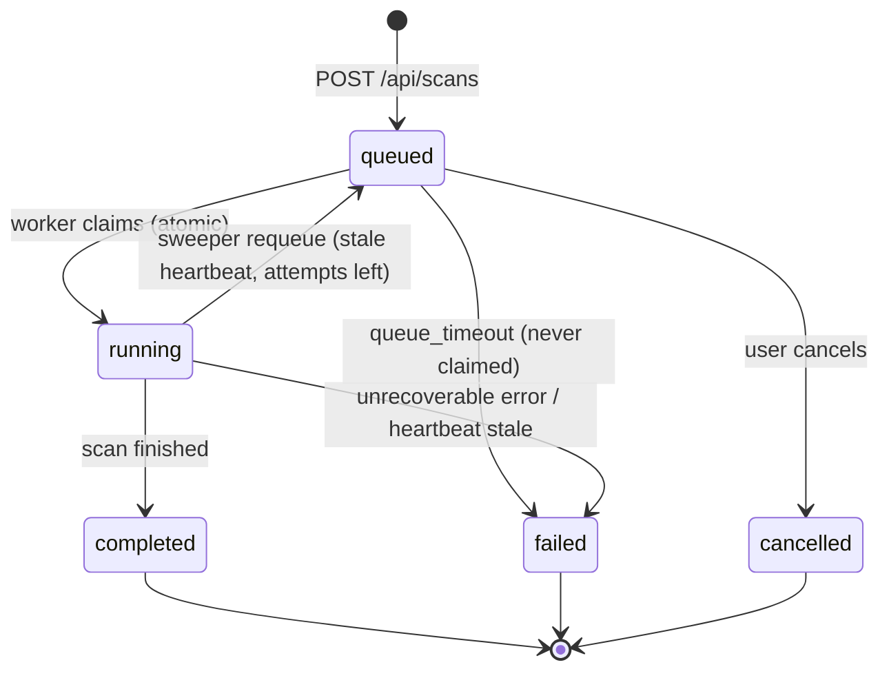
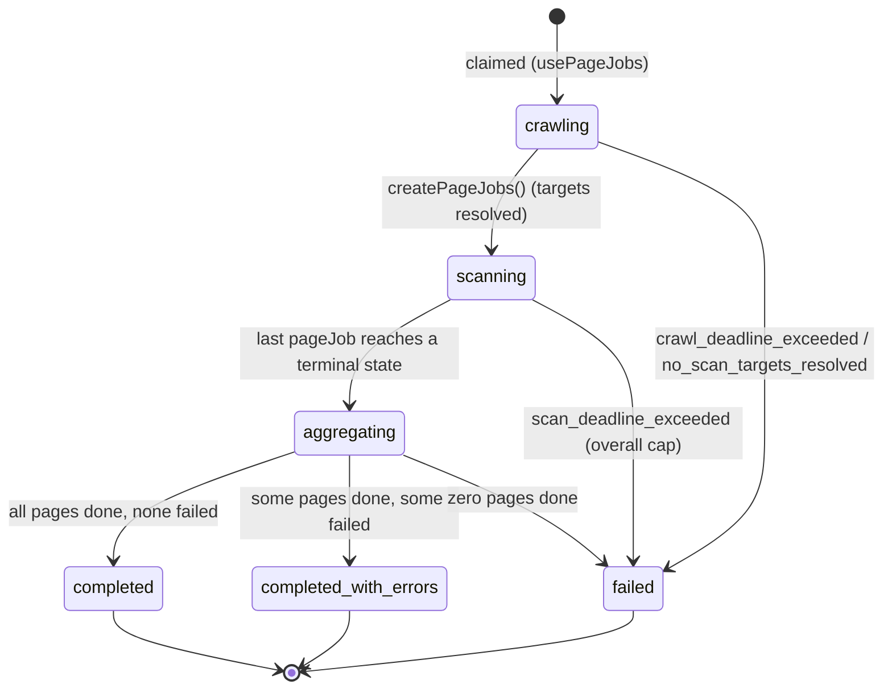
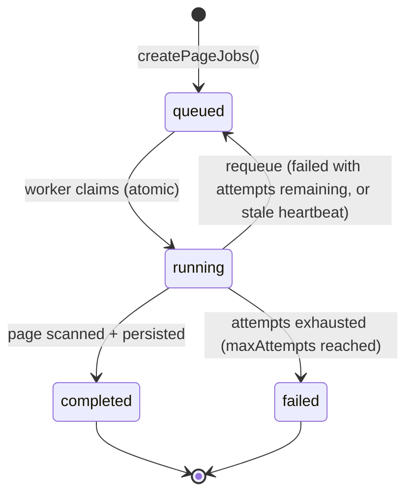
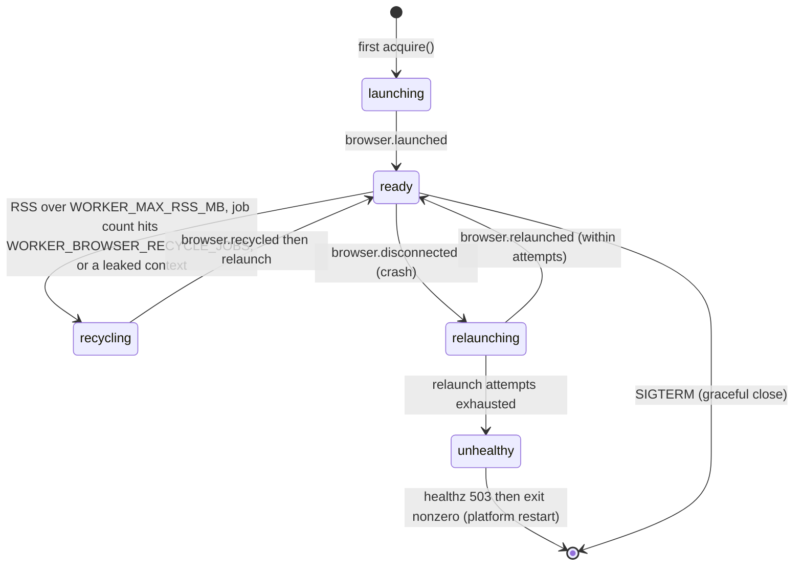

# Runbook — scan pipeline

Operator-facing reference for the accessibility scan pipeline: how a scan moves
through its states, what every failure code means and what to do about it, the
watchdog rules that guarantee no job stays in limbo, the tuning env vars, and a
fast checklist for a stuck scan.

Deployment and the browser worker's internals live in
[worker-deploy.md](worker-deploy.md); this doc is about operating the pipeline.

## Pipeline at a glance

```
Browser → POST /api/scans (Vercel)            Firestore                 Worker container
            creates scans/{id} status=queued  ──────────►  poll + atomic claim
                                                            ├─ legacy path:  runScanJob() (one crawl)
                                                            └─ page-jobs:    create pageJobs → scan each → aggregate
            progress page ◄── onSnapshot / GET /api/scans/:id/status ◄── worker writes progress + terminal state
```

Two execution paths coexist, chosen per-scan at creation by the
`usePageJobs` flag (set from `PAGE_JOBS_ENABLED`):

- **Legacy / monolithic** — one worker runs the whole crawl in `processScanJob`.
  Used for scans created before the flag, and whenever `PAGE_JOBS_ENABLED` is off.
- **Per-page jobs (Phase 3)** — the scan is decomposed into independent
  `pageJobs`; a single hanging/broken page can only fail itself, and the worker
  that finishes the last page aggregates and sets the terminal state.

The worker handles **both** paths, so it can be deployed ahead of any flag flip.

---

## State machines

### Scan status (`scans/{id}.status`)

The coarse lifecycle. Every scan has a status; only page-jobs scans also carry a
`phase` (below).



### Scan phase (page-jobs model only — `scans/{id}.phase`)

Orthogonal to `status`. A `status=completed` scan is `phase=completed` (clean) or
`phase=completed_with_errors` (some pages failed). Absent on legacy scans.



### Page job status (`scans/{id}/pageJobs/{id}.status`)



Retries are bounded by `PAGE_JOB_MAX_ATTEMPTS` (default 2 = initial + one retry).
A failed page never fails the scan; it shows in the `FailedPagesNotice` and the
score is computed from the pages that completed.

### Shared browser lifecycle (worker process — Phase 4)

Not persisted in Firestore; this is the in-process Chromium the worker shares
across page jobs. Surfaced in worker logs (`browser.*`) and `/health`.



### Analysis engine — how one page is scanned

One page = one browser context **per viewport** (desktop / tablet / mobile),
not per variant.

```
per viewport:
  goto(domcontentloaded)                     ← the only navigation in the happy path
  waitForSettled: load (<=5s) + networkidle (<=2s, best effort)
  axe pass                                    ← "initial" variant
  for each interactive state (menu, dialog, accordion, tab, form-focus):
    for each candidate (max 2):
      fingerprint → applyState → settle 350ms → fingerprint
        unchanged? skip the axe pass (the control did nothing)
        changed?   axe pass = one more variant
      revertState → fingerprint must match the baseline
        mismatch → reload (max 2 per viewport), else stop this viewport
  dispose page + context (bounded; a refusal is reported as a leak)
```

Two properties this relies on:

1. **Network idle is a bonus, never a requirement.** Sites with analytics,
   polling or websockets never go idle. The old engine waited for idle on
   every variant (up to 8s × 33 variants) and routinely spent the whole job
   budget before finishing one page. `load` is the contract now.
2. **Nothing that talks to the renderer is unbounded.** `page.evaluate`,
   `content()`, `title()`, `close()` are not covered by Playwright's default
   timeout — a page that busy-loops holds them forever. Every one of them goes
   through `withOp()` in `src/lib/scanner/page-ops.ts`.

### Parallelism — two numbers, one ceiling

A crawl scans several pages at once. Two settings control it and they are not
interchangeable:

| Setting | Default | Meaning |
| --- | --- | --- |
| `SCAN_MAX_CONCURRENT_CONTEXTS` | 2 | **Hard memory ceiling.** Max browser contexts open at any moment in the worker process, across every scan and every page job. This is the number tied to instance RAM. |
| `SCAN_PAGE_CONCURRENCY` | 2 | How many pages a *single* scan tries to run at once. Purely a shaping knob — every page still queues on the ceiling above. |

Raising `SCAN_PAGE_CONCURRENCY` alone can never increase peak memory; it only
lets one scan use slots that would otherwise sit idle while other jobs are
quiet. Raising `SCAN_MAX_CONCURRENT_CONTEXTS` **does** raise peak memory and
must be matched with RAM (see `docs/worker-deploy.md`).

The slot is taken per *viewport*, not per page, so a second scan never waits
behind a whole page — at most one viewport pass (~2–3s).

Crawl invariants that hold under concurrency:

- **Exact page cap.** Claiming a URL, counting it and enqueuing discovered
  links all happen synchronously in one tick, so two workers cannot claim the
  same URL or overshoot `maxPages`.
- **Stable output order.** Results are returned in claim order, not completion
  order, so a report does not reshuffle because one page was slow.
- **Frontier patience.** A crawl starts from a single seed; a worker that finds
  an empty queue waits while peers are still scanning rather than exiting,
  otherwise the crawl would collapse back to one worker.
- **Exact screenshot budget.** The visual-evidence budget is reserved before
  the capture and returned if it fails, so parallel pages cannot both take the
  last screenshot.

Measured on a 6-page fixture (250ms server latency, three viewports per page):
56.6s at concurrency 1 → 31.7s at 2 → 22.3s at 3, with identical findings
(78) and identical navigation counts (18).

`/health` reports `contexts: { size, inFlight, queued }`. A `queued` value that
stays above zero means the memory ceiling — not CPU — is pacing scans.

Page metadata carries the engine's own telemetry: `navigations`,
`renavigations`, `skippedUnchangedVariants`, `opTimeouts`, `viewportsFailed`,
`scriptErrors`, `contextLeaked`, `degraded`. Those are the first fields to read
when a scan looks wrong.

### Code that runs inside the scanned page

Everything the scanner executes in the page lives in
`src/lib/scanner/browser-scripts.ts` **as strings**, and is called through
`inlineScript()`.

This is not a style choice. The worker runs under tsx/esbuild
(`CMD npx tsx worker/serve.ts`), and esbuild's `keepNames` rewrites named
arrows inside a `page.evaluate` callback into `__name(…)` calls. `__name` does
not exist in the browser, so the callback threw
`ReferenceError: __name is not defined` — and because a page-side throw was
read as "this page has no menu", every interactive-state pass silently did
nothing in production while the scan still reported success. Strings are
opaque to the bundler, so the failure mode cannot return.
`browser-scripts.test.ts` fails the build if a bundler helper ever appears in
one of those strings.

---

## Error codes

`errorCode` is machine-readable; `errorMessage` carries the user-facing text.
"Layer" is where the code originates. "User sees" is what the UI renders (scan
failures go through `humanizeError()` / `SWEEP_ERROR_MESSAGES`; per-page failures
render in `FailedPagesNotice`).

### Scan-level (fail the whole scan)

| errorCode | Layer | User sees | Operator action |
|---|---|---|---|
| `permission_not_confirmed` | API/worker | "Permission confirmation was missing." | User error — the scan was created without the consent checkbox. No action; user re-creates the scan. |
| `queue_timeout` | sweeper | "No worker capacity was available. Please retry or contact support." | **No worker claimed the job in 30 min.** Check the worker is running and `/api/healthz?deep=1` shows a fresh worker; check the Firestore composite index on `scans (status, createdAt)` exists. |
| `worker_heartbeat_stale` | sweeper | "The scan worker stopped responding. Please retry." | Worker died mid-scan and exceeded `WORKER_STALE_RECLAIM_LIMIT` reclaims. Check worker logs/restarts (OOM? crash-loop?). Safe to retry the scan. |
| `scan_deadline_exceeded` | sweeper | "The scan exceeded its overall processing window. Partial page results may be available." | A page-jobs scan ran past `SCAN_OVERALL_CAP_MS` (15 min). Usually a very large/slow site or stuck pages — inspect pageJobs (see "stuck scan"). |
| `crawl_deadline_exceeded` | worker | (raw) "crawl_deadline_exceeded" | Multi-page link discovery exceeded `CRAWL_RESOLUTION_TIMEOUT_MS`. Often a slow/huge sitemap. Retry; consider a single/manual scan. |
| `no_scan_targets_resolved` | worker | (raw) | Source plan produced zero URLs (bad sitemap/source list). Verify the base URL and any provided sitemap/source URLs. |
| `scan_timeout` | worker (legacy) | "The scan exceeded its time budget." | Legacy monolithic scan hit `WORKER_SCAN_TIMEOUT_MS`. Retry; prefer the page-jobs path. |
| `browser_launch_failed` | worker | "Browser worker could not launch Chromium. Completed a static HTML scan instead." | **Not a hard failure** — the scan degrades to a static HTML scan. If you see it consistently, the worker image/Chromium is broken (wrong base image, missing libs). Rebuild `Dockerfile.worker`. |

### Page-level (fail one page; recorded on the pageJob, never sinks the scan)

| errorCode | Layer | User sees (FailedPagesNotice) | Operator action |
|---|---|---|---|
| `page_deadline_exceeded` | worker | "Page scan exceeded its 60s deadline." | The page ignored every internal budget and hit the hard `PAGE_JOB_DEADLINE_MS`. Usually a heavy SPA / infinite loader. Expected for pathological pages; no action unless widespread. |
| `navigation_failed` | engine | navigation message | Site refused connection, returned an error, or a redirect was rejected by the SSRF guard. Check the URL is reachable and not redirecting off-origin. |
| `axe_failed` | engine | axe message | axe-core failed/timed out injecting or analyzing. Often a CSP that blocks injection or a page that never settles. Retry; if persistent, investigate the page. |
| `deadline_exceeded` | engine | deadline message | The internal per-page budget ran out before any viewport completed. Slow page; the retry may succeed. |
| `state_unavailable` | engine | state message | An interactive-state variant (menu/dialog/etc.) couldn't be reached — benign, recorded per-variant. No action. |
| `page_unavailable` | engine | "page unavailable" | The page could not be loaded at all (DNS, 4xx/5xx, blocked target). Verify the URL. |
| `worker_heartbeat_stale` | page sweeper | "The worker processing this page stopped responding." | The page worker died; the page was reclaimed and exhausted its attempts. Tied to worker restarts/OOM — check worker health. |
| `page_scan_failed` | worker | (generic fallback) | Unclassified page error. Check worker logs for the underlying message. |
| `private_ip` (URL validation) | engine | "URL validation failed…" | The page resolved to a private/blocked IP (SSRF guard). Expected for internal hosts; not scannable. |

### Worker-internal (browser manager — logged, not user-facing)

| code / log event | Meaning | Operator action |
|---|---|---|
| `browser.recycled` | Memory guard closed+relaunched Chromium (`reason: rss` or `jobs`). | Informational. Frequent `rss` recycles → consider more RAM or a lower `WORKER_BROWSER_RECYCLE_JOBS`. |
| `browser.disconnected` → `browser.relaunched` | Chromium crashed and was auto-recovered; the in-flight page job requeued. | Informational if occasional. A steady stream means the box is memory-starved. |
| `browser_relaunch_exhausted` → `browser.unhealthy` | Relaunch failed `WORKER_BROWSER_RELAUNCH_ATTEMPTS` times; worker fails `/health` and exits nonzero. | The platform restarts the container. If it crash-loops, the image/host is broken — check memory limits and `Dockerfile.worker`. |

---

## Sweeper rules & intervals

Every worker runs an **independent** watchdog every **60 s** (`SWEEP_INTERVAL_MS`,
constant in `worker/index.ts`). Decisions are pure functions (`sweepScans`,
`sweepPageJobs`) applied via state-rechecking transactions, so concurrent
sweepers and stale snapshots are safe (an action that no longer matches the live
doc is a no-op). Terminal states are never touched.

**Scan-level (`sweepScans`):**

1. `running` + heartbeat older than `SWEEP_STALE_RUNNING_MS` (defaults to
   `WORKER_STALE_RUNNING_MS`) → **requeue** (increment `reclaimAttempts`, clear
   `claimedBy`).
2. `running`/`queued` + `reclaimAttempts ≥ WORKER_STALE_RECLAIM_LIMIT` → **fail**
   `worker_heartbeat_stale`.
3. `queued` + `createdAt` older than `SWEEP_QUEUE_TIMEOUT_MS` (30 min) → **fail**
   `queue_timeout`.
4. **page-jobs exception:** while a page-jobs scan is `phase=scanning|aggregating`,
   the scan-level watchdog does **not** reclaim it on heartbeat (page workers have
   their own heartbeats); it only fails it if it runs past `SCAN_OVERALL_CAP_MS`
   (15 min) → `scan_deadline_exceeded`.

**Page-level (`sweepPageJobs`):** only `running` pageJobs are swept.

- heartbeat older than `PAGE_JOB_STALE_MS` (90 s) + attempts remain → **requeue**.
- heartbeat stale + `attempts ≥ PAGE_JOB_MAX_ATTEMPTS` → **fail**
  `worker_heartbeat_stale`.
- `queued` pageJobs are left for a worker to claim (a scan that never progresses
  is caught by the scan-level overall cap).

**Aggregation recovery:** the sweeper also re-triggers aggregation for page-jobs
scans whose pages are all terminal but whose phase is stuck in `aggregating`.

**Heartbeats that feed the rules:**

| Heartbeat | Interval (default) | Written by |
|---|---|---|
| Scan `processorHeartbeatAt` | `WORKER_HEARTBEAT_MS` (15 s) | worker while a legacy scan / aggregation runs |
| PageJob `heartbeatAt` | `PAGE_JOB_HEARTBEAT_MS` (20 s, min 5 s) | worker while a page job runs |
| Worker liveness (`workerHeartbeats`) | `WORKER_HEARTBEAT_MS` (15 s) | worker process; read by `/api/healthz?deep=1` |

---

## Env vars

Tuning vars relevant to the pipeline. Worker-process vars are read by the worker
container; flag/budget vars are read wherever the code runs.

### Added for the per-page model (Phase 3)

| Var | Default | Effect |
|---|---|---|
| `SCAN_MAX_CONCURRENT_CONTEXTS` | 2 | Process-wide ceiling on concurrent browser contexts. Tied to instance RAM — raise only with more memory. |
| `SCAN_PAGE_CONCURRENCY` | 2 | Pages one scan runs at once. Bounded by the ceiling above; safe to raise on its own. |
| `PAGE_JOBS_ENABLED` | off | When truthy (`1/true/yes/on`), new scans are stamped `usePageJobs` and run the per-page path. |
| `PAGE_JOB_MAX_ATTEMPTS` | 2 | Attempts per page (initial + retries). |
| `PAGE_JOB_DEADLINE_MS` | 60000 | Hard per-page wall-clock budget. |
| `PAGE_JOB_STALE_MS` | 90000 | Heartbeat age before a running pageJob is reclaimed (must exceed the page deadline). |
| `PAGE_JOB_HEARTBEAT_MS` | 20000 | PageJob heartbeat cadence. |
| `SCAN_OVERALL_CAP_MS` | 900000 | Overall wall-clock cap for a page-jobs scan (sweeper backstop). |

### Added for browser lifecycle + memory hardening (Phase 4)

| Var | Default | Effect |
|---|---|---|
| `WORKER_MAX_RSS_MB` | 1536 | Recycle Chromium once process RSS exceeds this. |
| `WORKER_BROWSER_RECYCLE_JOBS` | 50 | Recycle Chromium after this many page jobs. |
| `WORKER_BROWSER_RELAUNCH_ATTEMPTS` | 3 | Crash relaunch attempts before the worker reports unhealthy and exits. |
| `WORKER_BROWSER_RELAUNCH_BASE_MS` | 500 | Exponential-backoff base between relaunch attempts. |

### Pre-existing worker/sweeper vars (for context)

| Var | Default | Effect |
|---|---|---|
| `WORKER_CONCURRENCY` | 2 | Concurrent contexts on the one shared browser. **2 on a 2 GB instance is the supported baseline.** |
| `WORKER_POLL_INTERVAL_MS` | 3000 | Firestore poll cadence. |
| `WORKER_HEARTBEAT_MS` | 15000 | Scan/worker heartbeat cadence. |
| `WORKER_SCAN_TIMEOUT_MS` | 120000 | Legacy whole-scan deadline. |
| `WORKER_STALE_RUNNING_MS` | 45000 | Heartbeat age before a running scan is reclaimed (deployments set 180000). |
| `WORKER_STALE_RECLAIM_LIMIT` | 3 | Reclaims before a scan is failed `worker_heartbeat_stale`. |
| `SWEEP_QUEUE_TIMEOUT_MS` | 1800000 | Age before a still-queued scan is failed `queue_timeout`. |
| `WORKER_SHUTDOWN_DRAIN_MS` | 5000 | Drain window for in-flight jobs on SIGTERM before requeue. |
| `WORKER_HEALTH_PORT` / `PORT` | — | Enables the worker `/health` server. |
| `SCAN_RENDER_PROFILE` | real | `real` loads CSS/fonts/images (accurate contrast); `minimal` blocks them. |

---

## Scan is stuck — diagnosis in 5 steps

A "stuck" scan is one sitting in `queued` or `running` longer than expected. Work
top-down; each step narrows the cause.

1. **Read the scan doc.** `scans/{id}` — note `status`, `phase`, `usePageJobs`,
   `claimedBy`, `processorHeartbeatAt`, `reclaimAttempts`, `errorCode`.
   - `status=queued` and old → go to step 2 (nothing is claiming it).
   - `status=running`, `processorHeartbeatAt` advancing → it's progressing; not
     stuck. `phase=scanning` with a stale scan heartbeat is normal (page workers
     heartbeat separately) → go to step 4.

2. **Is a worker alive and claiming?** `GET /api/healthz?deep=1` →
   `checks.worker.ok` and `lastSeenSecondsAgo`. If stale/`degraded`, the worker
   is down or can't reach Firestore. Check the container is running and its logs
   show `[worker] starting`. A persistently unclaimed queue with a live worker
   usually means a **missing Firestore composite index** on
   `scans (status, createdAt)` — the first worker run logs a console link to
   build it; or deploy `firestore.indexes.json`. Scan creation also requires
   the `scans.status` single-field ASC index in normal `COLLECTION` scope;
   defining only the `COLLECTION_GROUP` override disables that default index
   and makes `POST /api/scans` return `firestore_index_unavailable`.

3. **Is the worker's browser healthy?** Worker `/health` → `browserHealthy`
   and `browser` stats. Grep worker logs for `browser.disconnected`,
   `browser.relaunch-failed`, `browser.unhealthy`. A crash-looping browser
   (relaunch exhausted → exit nonzero) means the host is memory-starved or the
   image is broken — check RAM vs `WORKER_CONCURRENCY` and `Dockerfile.worker`.

4. **Inspect the pageJobs** (page-jobs scans). List `scans/{id}/pageJobs`:
   - All `completed`/`failed` but scan `phase=aggregating` → aggregation is
     stuck; the 60 s sweeper re-triggers it (`claimAggregation`). Confirm a
     worker is alive (step 2).
   - One stuck `running` with an old `heartbeatAt` → the page sweeper requeues it
     after `PAGE_JOB_STALE_MS` (90 s); after `PAGE_JOB_MAX_ATTEMPTS` it fails as
     `worker_heartbeat_stale` and the scan finishes `completed_with_errors`.
   - Many `queued`, none `running` → no worker capacity (back to step 2).

5. **Let the watchdog finish, or force it.** The sweeper guarantees terminal
   resolution: stale-running → requeue → (after limit) fail; queued > 30 min →
   `queue_timeout`; page-jobs scan > 15 min → `scan_deadline_exceeded`. If you
   must act now, use the maintenance scripts:
   `scripts/cleanup-stuck-scan.ts` (resolve a specific stuck scan) or
   `scripts/admin-clear-scan-data.ts`. Then have the user retry
   (`POST /api/scans/:id/retry`). If it recurs, capture worker logs for the scan
   id (every line carries `scanId`) and escalate.

---

## Rollout plan

The worker handles both legacy and page-jobs scans, so deploy it first and flip
the flag second; nothing in the web app depends on the new worker behavior until
`PAGE_JOBS_ENABLED` is on.

1. **Deploy the worker first.** Run `scripts/deploy-cloud-run.sh`; it builds
   `Dockerfile.worker`, configures private OIDC invocation and creates the queue
   and Scheduler recovery jobs.
2. **Deploy the web app.** Push the Vercel app. With `PAGE_JOBS_ENABLED` unset,
   `usePageJobs` stays false and every new scan still takes the legacy path. No
   behavior change for users yet.
3. **Enable during a quiet window.** Turn `PAGE_JOBS_ENABLED` on and run real scans:
   single, multi-page, and a deliberately broken page. Confirm:
   - scans reach `completed` / `completed_with_errors`, never wedge;
   - failed pages show in `FailedPagesNotice` without sinking the scan;
   - worker logs show `browser.recycled` over time and **no** `browser.unhealthy`;
   - RSS is flat across many scans.
4. **Bake for 48 h, then widen.** Leave it on for the internal workspace for at
   least 48 h. Widen only after the logs are clean: no `worker_heartbeat_stale` /
   `queue_timeout` spikes, no relaunch-exhaustion exits, no unbounded RSS, no
   stuck-scan reports.
5. **Rollback** is a single flag flip: set `PAGE_JOBS_ENABLED` off. In-flight
   page-jobs scans finish on their own (the worker still handles them); all new
   scans revert to the legacy path immediately. No redeploy required.

---

## Follow-ups deliberately NOT done

Scoped out of this phase — listed so they aren't silently dropped:

- **Aggregation as its own job type.** Aggregation currently piggybacks on the
  worker that completes the last page (and the sweeper re-triggers it if that
  worker dies). A dedicated `aggregationJob` (claimable, retryable, with its own
  heartbeat) would be cleaner and remove the "stuck in `aggregating`" failure mode
  that the sweeper papers over.
- **Queue-depth tuning.** Cloud Tasks and Cloud Run autoscaling are active;
  tune dispatch rate and max instances from production measurements.
- **Per-workspace flag storage.** `PAGE_JOBS_ENABLED` is a single process-wide
  env flag. Targeting one workspace during rollout is operational, not a true
  per-workspace toggle in the data model.
- **Distributed RSS / cgroup-aware memory guard.** The memory guard reads
  `process.memoryUsage().rss`, not the container cgroup limit. On a tightly
  capped container the OS could OOM-kill before the soft RSS threshold; we rely on
  crash recovery + restart for that case rather than reading cgroup memory.
- **`.env.example` for staging credentials / autoscale knobs** beyond the tuning
  vars documented above.
- **Browser-level metrics export.** `browser.*` events are logged for grepping
  but not exported to a metrics backend (recycle rate, relaunch count, RSS
  histogram). A dashboard would make the 48 h bake objective rather than log-read.
