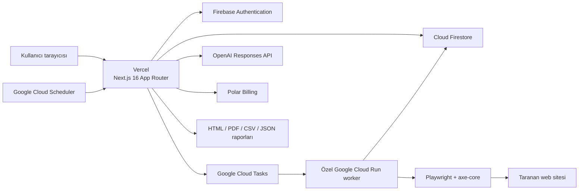
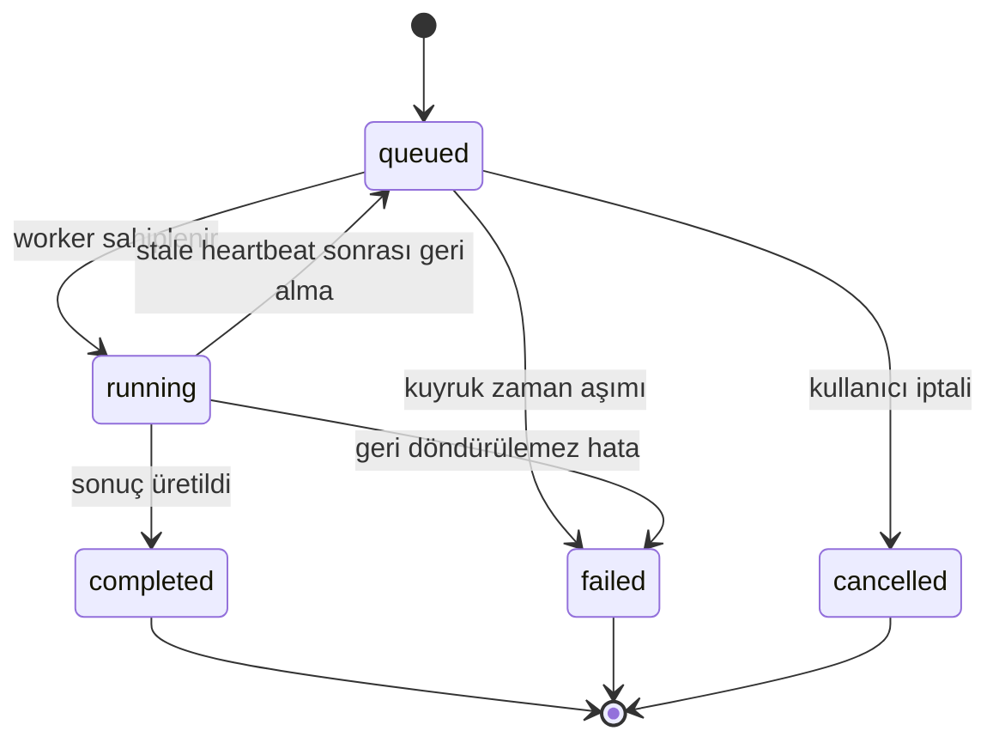

# Percevia AI — Proje ve Teknik Kapsam Raporu

> **İnceleme tarihi:** 23 Haziran 2026  
> **İncelenen sürüm:** `feat/scan-monitoring-foundation` dalındaki güncel çalışma ağacı  
> **Ürün adı:** maitrico Percevia AI  
> **Rapor türü:** Sunum hazırlığı, teknik mimari, ürün kapsamı ve mevcut durum değerlendirmesi  
> **Dayanak:** Uygulama kodu, API rotaları, worker kodu, Firestore modeli, testler ve operasyon belgeleri

## 1. Yönetici Özeti

Percevia AI, web sitelerindeki erişilebilirlik problemlerini yalnızca tespit eden bir tarayıcı değil; tarama, önceliklendirme, ekip çalışması, düzeltme yönetimi, yeniden doğrulama, raporlama ve sürekli izleme süreçlerini tek çalışma alanında birleştiren gizlilik odaklı bir erişilebilirlik operasyon platformudur.

Platformun ana tarama motoru gerçek Chromium oturumlarında çalışan Playwright ve axe-core teknolojilerini kullanır. Sistem masaüstü, tablet ve mobil görünüm boyutlarını; menü, diyalog, akordeon, sekme ve form odağı gibi etkileşim durumlarını analiz eder. Üretilen ham bulgular normalize edilir, tekrarlanan sorunlar kök nedenlerine göre gruplanır, önem ve risk skorları hesaplanır ve ekiplerin takip edebileceği düzeltme görevlerine dönüştürülebilir.

Ürün; yapay zekâ destekli açıklamalar, kod önerileri, görsel kanıt, teknik ve yönetici raporları, ekip rolleri, denetim kayıtları, veri saklama ve silme politikaları, abonelik yönetimi ve plan bazlı sürekli tarama özellikleri içerir.

Percevia AI bilinçli olarak hukuki uyumluluk veya sertifikasyon garantisi vermez. Otomatik tarama sonuçları teknik karar desteği olarak ele alınır ve insan incelemesinin yerine geçmez.

### 30 saniyelik sunum metni

> Percevia AI, web erişilebilirliği çalışmalarını tek seferlik denetimlerden sürdürülebilir bir operasyon sürecine dönüştürür. Gerçek tarayıcı üzerinde Playwright ve axe-core ile sorunları tespit eder, aynı kök nedenden oluşan tekrarları birleştirir, ekiplerin düzeltme görevleri oluşturmasını sağlar ve sonuçları teknik ya da yönetici odaklı raporlara dönüştürür. Yapay zekâ açıklamaları ve görsel kanıt özellikleri açık kullanıcı iznine bağlıdır. Sistem yasal uyumluluk garantisi vermez; otomatik analiz ile uzman incelemesini birlikte çalıştırmayı hedefler.

## 2. Projenin Çözdüğü Problem

Web erişilebilirliği çalışmalarında temel sorun yalnızca hata bulmak değildir. Ekipler genellikle şu zorluklarla karşılaşır:

- Farklı araçlardan gelen yüzlerce tekrarlı bulgunun yönetilememesi
- Hangi hatanın önce düzeltilmesi gerektiğinin anlaşılamaması
- Teknik bulguların yönetici veya müşteri diline çevrilememesi
- Düzeltmelerin görev, sorumlu ve durum bilgisiyle takip edilememesi
- Bir sürümden diğerine erişilebilirlik seviyesinin izlenememesi
- Otomatik testlerin sınırlarının kullanıcıya doğru anlatılamaması
- Ekran görüntüsü, yapay zekâ ve tarama verilerinin gizlilik kontrollü yönetilememesi
- Ajans, geliştirici, denetçi ve müşteri gibi farklı kullanıcıların aynı veri üzerinde farklı yetkilerle çalışamaması

Percevia AI bu problemi “bulgu listesi” yerine bir operasyon döngüsü kurarak çözmeye çalışır:

```text
Tarama → Kök neden analizi → Önceliklendirme → Görevlendirme
       → Düzeltme → Yeniden tarama → Karşılaştırma → Raporlama
```

## 3. Ürünün Temel Değer Önerisi

Percevia AI'ın temel farkı, erişilebilirlik taramasını ekiplerin günlük çalışma düzenine bağlamasıdır.

1. **Gerçek tarayıcı analizi:** Yalnızca indirilen HTML değil, çalışan sayfa ve hesaplanmış erişilebilirlik ağacı incelenir.
2. **Etkileşim durumları:** Açılan menü, diyalog, sekme ve odak durumları ayrıca test edilir.
3. **Kök neden gruplama:** Aynı bileşenden kaynaklanan tekrarlar tek düzeltme başlığı altında birleştirilir.
4. **Operasyonel takip:** Bulgular durumlandırılabilir ve düzeltme görevlerine dönüştürülebilir.
5. **Gizlilik kontrollü AI:** Yapay zekâ işlemleri varsayılan olarak kapalıdır ve çalışma alanı izni gerektirir.
6. **Gizlilik kontrollü görsel kanıt:** Ekran görüntüsü üretimi ve saklanması iki aşamalı onaya bağlıdır.
7. **Sunuma uygun raporlama:** Teknik ekip, yönetici ve müşteri için farklı çıktı seviyeleri sunulur.
8. **Sürekli izleme:** Ücretli planlarda belirli aralıklarla otomatik yeniden tarama planlanabilir.
9. **Çok kullanıcılı yapı:** Roller, izinler, koltuk sınırları ve davet akışı bulunur.
10. **Hukuki iddia sınırı:** Ürün, otomatik test sonucunu sertifika veya yasal uygunluk garantisi olarak sunmaz.

## 4. Ürün Kapsamı ve Mevcut Durum

| Modül | Durum | Açıklama |
|---|---|---|
| Pazarlama ve fiyatlandırma sayfaları | Uygulandı | Ürün anlatımı, planlar, SSS ve yasal sınırlar |
| Firebase kimlik doğrulama | Uygulandı | E-posta bağlantısı ve GitHub girişi |
| Çalışma alanı ve onboarding | Uygulandı | Şirket, standart, plan ve çalışma alanı kurulumu |
| Tek sayfa taraması | Uygulandı | Bir URL'nin gerçek tarayıcıyla analizi |
| Çok sayfalı tarama | Uygulandı | Aynı köken bağlantılarını sayfa sınırına kadar keşfetme |
| Site haritası taraması | Uygulandı | Varsayılan veya kullanıcı tarafından verilen sitemap |
| Manuel URL listesi | Uygulandı | Aynı kökene ait kullanıcı tanımlı URL listesi |
| Masaüstü/tablet/mobil taraması | Uygulandı | Üç sabit viewport |
| Etkileşim durumu taraması | Uygulandı | Menü, diyalog, akordeon, sekme ve form odağı |
| Kök neden gruplama | Uygulandı | Kural, selector ve kontrast renk çiftine göre |
| Skorlama ve risk sınıflandırması | Uygulandı | Genel, kategori ve sayfa skorları |
| Bulgu durum yönetimi | Uygulandı | İnceleme, planlama, devam, düzeltildi, risk kabulü vb. |
| Düzeltme görevleri | Uygulandı | Oluşturma, güncelleme, silme ve proje klasörleme |
| Tarama karşılaştırması | Uygulandı | Geçmiş taramalar arasındaki değişim |
| AI açıklaması ve kod önerisi | Yapılandırmaya bağlı | OpenAI anahtarı ve çalışma alanı izni gerekir |
| Görsel kanıt | Yapılandırmaya bağlı | Çalışma alanı ve tarama bazında açık izin gerekir |
| HTML/CSV/JSON raporları | Uygulandı | İstek sırasında üretilir |
| PDF raporu | Uygulandı, ortam bağımlı | Sunucu tarafında Chromium çalışabilmelidir |
| Herkese açık rapor bağlantısı | Uygulandı | İptal edilebilir, token tabanlı ve `noindex` |
| Ekip rolleri ve davet | Uygulandı | Firebase e-posta bağlantısı, manuel link alternatifi |
| Bildirim merkezi | Uygulandı | Audit log verilerinden bildirim ve okunmamış sayısı |
| Gizlilik merkezi | Uygulandı | AI, ekran görüntüsü, saklama, dışa aktarma ve silme |
| Asenkron veri silme | Uygulandı | Worker tarafından çalıştırılan ve doğrulanan silme işi |
| Veri saklama cron'u | Uygulandı | Çalışma alanı politikasına göre otomatik temizlik |
| Polar abonelik yönetimi | Yapılandırmaya bağlı | Checkout, portal ve imzalı webhook |
| Sürekli izleme | Uygulandı | Plan bazlı günlük/3 günlük/haftalık yeniden tarama |
| İzleme e-posta/Slack alarm teslimi | Henüz tamamlanmamış | Kanal ve eşik verisi saklanıyor, mesaj gönderimi yok |
| Kurumsal SSO | Yol haritası | SAML/OIDC henüz uygulanmamış |
| Özel/on-prem tarama | Yol haritası | Fiyatlandırma sayfasında gelecek özellik |
| Yerel tarayıcı ajanı | Yol haritası | Henüz üretim kapsamında değil |

## 5. Hedef Kullanıcılar

### Ürün ve proje yöneticileri

- Erişilebilirlik borcunu görünür hale getirir.
- Kritik problemleri ve zaman içindeki değişimi izler.
- Düzeltme yol haritası ve yönetici raporu oluşturur.

### Yazılım geliştiricileri

- Hatalı HTML parçasını, selector'ı ve axe kuralını inceler.
- WCAG etiketlerini ve etkilenen sayfaları görür.
- Yapay zekâ destekli kod örneği ve doğrulama adımı alır.
- Düzeltme görevini durumlandırır.

### Erişilebilirlik uzmanları ve denetçiler

- Otomatik bulguları değerlendirir.
- Yanlış pozitifleri ayırır.
- İnsan incelemesi gereken noktaları işaretler.
- Manuel kontrol listesini taramayla birlikte yürütür.

### Ajanslar

- Birden fazla müşteri veya proje bağlamında çalışır.
- Müşteri için markalı rapor oluşturur.
- `client_viewer` ve `report_viewer` gibi sınırlı roller kullanır.

### Yöneticiler ve müşteriler

- Teknik ayrıntıya girmeden risk özetini ve yol haritasını görüntüler.
- Paylaşılabilir rapor bağlantıları üzerinden sonuçları takip eder.

### Gizlilik ve uyumluluk sorumluları

- AI işleme, görsel kanıt ve saklama ayarlarını yönetir.
- Veriyi dışa aktarır veya silme süreci başlatır.
- Denetim kayıtlarını ve alt işleyen sağlayıcıları inceler.

## 6. Roller ve Yetkiler

Desteklenen roller:

| Rol | Temel yetki alanı |
|---|---|
| `owner` | Tüm çalışma alanı, faturalama, gizlilik, ekip ve silme işlemleri |
| `admin` | Tarama, gizlilik, ekip ve düzeltme yönetimi; faturalama hariç |
| `developer` | Tarama oluşturma, AI kullanımı ve düzeltme yönetimi |
| `auditor` | Tarama görüntüleme, AI kullanımı ve rapor dışa aktarma |
| `client_viewer` | Tarama ve düzeltme sürecini salt okunur izleme |
| `report_viewer` | Veri modelinde mevcut, uygulama izinleri çok sınırlı rol |

İzin matrisi şu eylemleri ayrı ayrı kontrol eder:

- `create_scans`
- `view_scans`
- `view_ai`
- `export_reports`
- `manage_billing`
- `manage_privacy`
- `delete_scans`
- `manage_team`
- `manage_remediation`
- `view_remediation`

Plan bazlı varsayılan koltuk sınırları:

| Plan | Üye sınırı |
|---|---:|
| Free | 1 |
| Starter | 3 |
| Agency | 10 |
| Team | 25 |
| Enterprise | 200 |

## 7. Uçtan Uca Kullanıcı Yolculuğu

### 7.1 Tanıtım ve kayıt

Kullanıcı ürün sayfasından fiyatlandırma, gizlilik yaklaşımı ve tarama metodolojisini inceler. Oturum açma Firebase Authentication üzerinden e-posta bağlantısı veya GitHub sağlayıcısıyla yapılır.

### 7.2 Çalışma alanı kurulumu

İlk girişte kullanıcı:

- Çalışma alanı adını
- Şirket bilgisini
- Hedef standardı
- Bölge tercihini
- Planı
- Teknik framework bilgisini

tanımlar. Çalışma alanı, sistemdeki ana veri ve yetki sınırıdır.

### 7.3 Tarama oluşturma

Kullanıcı:

- Tarama türünü seçer.
- Ana URL'yi girer.
- Sayfa sınırını belirler.
- Siteyi tarama yetkisine sahip olduğunu onaylar.
- İsteğe bağlı AI açıklamalarını açar.
- İsteğe bağlı görsel kanıt seçer.

API; URL'yi, plan sınırını, günlük kotayı, eşzamanlı tarama sayısını, gizlilik izinlerini ve worker yapılandırmasını doğrular.

### 7.4 Asenkron işlem

Tarama isteği içinde Chromium çalıştırılmaz. Firestore'a `queued` durumunda bir iş yazılır ve üretim modunda Cloud Tasks özel Cloud Run worker'ını uyandırır.

Worker:

1. İşi Firestore transaction'ı ile atomik olarak sahiplenir.
2. Çok sayfalı taramalarda hedef URL'leri çözer.
3. Sayfa bazlı işler oluşturur.
4. Playwright ve axe-core ile sayfaları tarar.
5. İlerleme ve heartbeat bilgilerini kaydeder.
6. Sonuçları kalıcılaştırır.
7. Bütün sayfalar tamamlandığında tarama özetini üretir.

### 7.5 Sonuç inceleme

Kullanıcı:

- Genel skor ve risk seviyesini
- Kritik, ciddi, orta, düşük ve inceleme bulgularını
- Sayfa ve kategori skorlarını
- Kök neden gruplarını
- Başarısız veya eksik taranan sayfaları
- Görsel kanıtları
- AI açıklamalarını

görüntüler.

### 7.6 Düzeltme ve doğrulama

Bulgu doğrudan düzeltme görevine dönüştürülebilir. Görev tamamlandıktan sonra yeni tarama çalıştırılarak önceki sonuçla karşılaştırma yapılabilir.

### 7.7 Raporlama ve paylaşım

Tamamlanan tarama için yönetici, teknik veya CSV odaklı rapor hazırlanabilir. HTML, PDF, CSV veya JSON indirilebilir; uygun yetkili kullanıcı raporu token tabanlı bağlantıyla paylaşabilir.

## 8. Güncel Sistem Mimarisi



### Mimari katmanlar

| Katman | Teknoloji | Sorumluluk |
|---|---|---|
| Ön yüz ve API | Next.js 16.2.6, React 19.2.4, TypeScript | Arayüz, sunucu bileşenleri, API rotaları |
| Stil ve tasarım | Tailwind CSS 4, özel UI bileşenleri | Responsive ve erişilebilir arayüz |
| Kimlik | Firebase Authentication | E-posta bağlantısı, GitHub, kimlik doğrulama |
| Oturum | Firebase session cookie | HTTP-only sunucu oturumu |
| Veri | Cloud Firestore | Çalışma alanı, tarama, bulgu, görev, rapor, audit |
| Kuyruk | Google Cloud Tasks | Worker'ı güvenilir ve tekrar deneyebilir biçimde uyandırma |
| Tarama worker'ı | Google Cloud Run | Uzun süreli Chromium gerektiren işleme |
| Tarayıcı motoru | Playwright 1.60 + Chromium | Gerçek sayfa yürütme ve etkileşim |
| Erişilebilirlik motoru | axe-core 4.11 | Otomatik erişilebilirlik kuralları |
| Zamanlama | Cloud Scheduler + Vercel Cron | Kurtarma, sürekli izleme ve veri saklama |
| Yapay zekâ | OpenAI Responses API | Açıklama, kod önerisi ve proje rehberliği |
| Ödeme | Polar | Checkout, portal ve abonelik webhook'ları |
| Gözlemlenebilirlik | Sentry/PostHog için opsiyonel adaptörler | Hata ve ürün analitiği |

## 9. Tarama İşlem Hattı

Üretim için önerilen yol:

```text
POST /api/scans
  └─ Firestore scans/{id}: status=queued
      └─ Cloud Tasks HTTP görevi
          └─ Private Cloud Run POST /process
              ├─ scan işini atomik sahiplen
              ├─ hedef URL'leri çöz
              ├─ pageJobs oluştur
              ├─ sayfaları paralel tara
              ├─ bulguları kaydet
              └─ sonucu aggregate et
```

### Tarama yaşam döngüsü



### Sayfa bazlı iş modeli

`PAGE_JOBS_ENABLED` açık olduğunda her URL bağımsız bir iş olur. Bu modelin avantajları:

- Tek bir yavaş sayfa bütün taramayı kilitlemez.
- Sayfa bazlı timeout ve yeniden deneme uygulanabilir.
- Başarısız sayfalar ayrı gösterilir.
- Sağlıklı sayfaların sonucu korunur.
- Büyük taramalar yatay olarak ölçeklenebilir.
- Son sayfa tamamlandığında aggregate işlemi çalışır.

Tarama fazları:

- `crawling`
- `scanning`
- `aggregating`
- `completed`
- `completed_with_errors`
- `failed`

Sayfa işi durumları:

- `queued`
- `running`
- `completed`
- `failed`

## 10. Tarama Motorunun Teknik Ayrıntıları

### 10.1 Tarama türleri

| Tür | Davranış |
|---|---|
| Single | Yalnızca verilen URL |
| Multi | Aynı kökendeki bağlantıları sayfa sınırına kadar keşfeder |
| Sitemap | Sitemap içindeki aynı köken URL'lerini tarar |
| Manual | Kullanıcının verdiği aynı köken URL listesini tarar |

### 10.2 Viewport matrisi

- Desktop: `1440 × 900`
- Tablet: `768 × 1024`
- Mobile: `390 × 844`

### 10.3 Etkileşim durumları

Her viewport için ilk durumun yanında şu durumlar denenir:

- Menü açık
- Diyalog açık
- Akordeon açık
- Sekme açık
- Form odağı

Her etkileşim türünde en fazla iki aday incelenir. Bu nedenle bir sayfa teorik olarak:

```text
3 viewport × (1 ilk durum + 5 etkileşim türü × 2 aday) = en fazla 33 analiz varyantı
```

üretebilir. Gerçek sayı sayfadaki uygun bileşenlere ve zaman bütçesine göre daha düşük olabilir.

### 10.4 Kaynak yükleme profilleri

- `real`: Stil, font ve görseller yüklenir; kontrast ve düzen analizi daha güvenilirdir.
- `minimal`: Maliyet için bazı kaynaklar engellenir; kontrast ve yerleşim duyarlılığı azalır.

Üretim worker'ı için önerilen profil `real` değeridir.

### 10.5 Güvenlik sınırları

- Sayfa başına yaklaşık 10 MB yanıt sınırı
- Navigasyon ve axe için ayrı timeout'lar
- Sayfa ve tarama seviyesinde sert zaman sınırları
- Service worker engelleme
- Ana frame için köken kontrolü
- Redirect sonrası URL ve DNS yeniden doğrulama
- Chromium süreç sağlığı ve bellek izleme

### 10.6 Statik fallback

Chromium başlatılamazsa veya gerçek tarayıcı analizi tamamlanamazsa sistem sınırlı statik HTML taramasına düşebilir. Bu sonuç:

- Düşük güven seviyesinde işaretlenir.
- Görsel kanıt içermez.
- Kullanıcıya gerçek tarayıcı analizinin tamamlanamadığı bildirilir.
- Normal Playwright + axe sonucuyla eşdeğer kabul edilmez.

## 11. URL Güvenliği ve SSRF Koruması

Tarama sistemi kullanıcı tarafından verilen bir URL'yi açtığı için SSRF koruması kritik bir güvenlik katmanıdır.

Uygulanan kontroller:

- Yalnızca HTTP ve HTTPS protokolleri
- URL ve hostname uzunluk sınırı
- Kullanıcı adı ve parolanın URL'den temizlenmesi
- Fragment bilgisinin kaldırılması
- `localhost`, `.internal`, `.local`, `.corp`, `.lan` gibi hedeflerin reddedilmesi
- IPv4 ve IPv6 özel, loopback, link-local ve multicast alanlarının engellenmesi
- `169.254.169.254` metadata adresinin özel olarak engellenmesi
- DNS çözümlemesi sonucundaki bütün IP'lerin denetlenmesi
- DNS rebinding riskine karşı worker aşamasında yeniden çözümleme
- Redirect sonrası nihai URL'nin yeniden doğrulanması
- Manual ve sitemap taramalarında aynı köken zorunluluğu
- Tarama yetkisi için kullanıcıdan açık onay

## 12. Bulgu Normalizasyonu

axe-core tarafından üretilen ham sonuçlar Percevia veri modeline dönüştürülür:

- Kural kimliği
- Etki seviyesi
- Ürün içi önem seviyesi
- WCAG etiketleri
- Açıklama ve yardım metni
- Yardım bağlantısı
- CSS hedefi
- Hatalı HTML örneği
- Hata özeti
- Viewport ve etkileşim bağlamı
- İnsan incelemesi gereksinimi
- Görsel kanıt metadatası

Bulgu durumları:

- `to_review`
- `planned`
- `in_progress`
- `needs_human_review`
- `fixed`
- `accepted_risk`
- `false_positive`

Durum değişiklikleri audit log'a yazılır.

## 13. Kök Neden Gruplama

axe-core aynı temel hatayı her DOM elemanı ve sayfa için ayrı kayıt olarak üretebilir. Percevia bu gürültüyü azaltmak için bulguları kök nedenlerine göre birleştirir.

Varsayılan gruplama anahtarı:

```text
kategori + standart türü + axe kuralı + normalize edilmiş selector
```

Özel durumlar:

- `color-contrast` sorunları ortak ön plan/arka plan renk çiftine göre birleştirilebilir.
- İnsan incelemesi bulguları doğrulanmış ihlallerle birleştirilmez.
- WCAG ve best-practice bulguları ayrı tutulur.
- `nth-child` gibi pozisyon kaynaklı selector gürültüsü temizlenir.

Her grup:

- Kuralı
- Başlığı
- En kötü önem seviyesini
- Etkilenen örnek sayısını
- Birincil WCAG etiketini
- Önerilen düzeltmeyi
- Öncelik puanını

taşır.

## 14. Skorlama Sistemi

Skorlama sürümü `percevia-score-v1` olarak saklanır.

Etki ağırlıkları:

| Etki | Ağırlık |
|---|---:|
| Critical | 10 |
| Serious | 6 |
| Moderate | 3 |
| Minor | 1 |
| Manual review | 2 |

Tekrarlanan bulgular için logaritmik bir occurrence çarpanı kullanılır ve bu çarpan üst sınırla kısıtlanır. Sayfa sayısı arttıkça toplam ceza karekök normalizasyonuyla dengelenir.

Üretilen sonuçlar:

- 0–100 genel skor
- A–F harf notu
- Düşük, orta, yüksek veya kritik risk
- Sayfa skorları
- Kategori skorları
- WCAG bulgu sayısı
- Best-practice bulgu sayısı
- Manuel inceleme sayısı

Kategori örnekleri:

- Renk kontrastı
- ARIA
- Klavye
- Formlar
- Metin alternatifleri
- Semantik yapı
- Dil
- Medya
- İyi uygulamalar

Bu skor bir hukuki uygunluk puanı değildir; önceliklendirme ve taramalar arası eğilim takibi içindir.

## 15. Görsel Kanıt Sistemi

Görsel kanıt iki seviyeli onaya bağlıdır:

1. Çalışma alanında görsel kanıt ve ekran görüntüsü saklama izni açık olmalıdır.
2. Kullanıcı ilgili taramada ekran görüntüsü seçeneğini ayrıca seçmelidir.

Sistem:

- Plan bazlı kanıt sayısı sınırı uygular.
- Hatalı elemanın selector, viewport, state ve bounding box bilgisini saklar.
- Hassas bölgelerde redaksiyon uygulamaya çalışır.
- Kanıtlara sona erme tarihi verir.
- Tek bir kanıtın görüntü verisinin silinmesine izin verir.
- Boyutu 650 KB üzerinde olan görselleri kalıcılaştırmaz.

V1'de görseller harici nesne depolama yerine Base64 olarak Firestore'da tutulur. Bu yaklaşım kurulum maliyetini düşürür, fakat Firestore belge boyutu ve okuma maliyeti nedeniyle ölçek sınırı oluşturur.

## 16. Yapay Zekâ Katmanı

### Kullanım alanları

- Tek bir bulgu için sade açıklama
- Teknik düzeltme özeti
- Kod örneği
- React/HTML/Shopify/WordPress odaklı öneri
- Doğrulama adımları
- Müşteri dostu açıklama
- Seçilmiş tarama bağlamına dayalı proje asistanı

### Gizlilik kuralları

- AI özelliği çalışma alanında açıkça etkinleştirilmelidir.
- HTML örneği 2 KB ile sınırlandırılır.
- Çerez gönderilmez.
- Form değerleri gönderilmez.
- Ekran görüntüsü gönderilmez.
- Seçilmiş taramanın sınırlı bulgu, sayfa ve grup özeti kullanılır.
- Kullanıcı bazlı hız sınırı uygulanır.
- İşlem audit log'a yazılır.

### Çıktı güvenliği

Sistem istemi modelin:

- Yasal uyumluluk garantisi vermesini
- Sertifika iddiasında bulunmasını
- “Tam uyumlu” veya “%100 uyumlu” demesini
- Overlay ürünlerini gerçek düzeltmenin alternatifi olarak önermesini

yasaklar. Üretilen metin ayrıca yasaklı ifadeler için sonradan temizlenir.

Varsayılan model yapılandırması `gpt-5.3-codex` değeridir ve ortam değişkeniyle değiştirilebilir.

## 17. Düzeltme Yönetimi

Bir bulgu veya kök neden grubu düzeltme görevine dönüştürülebilir.

Görev verileri:

- Başlık
- Açıklama
- Durum
- Öncelik
- Atanan üye
- Son tarih
- Notlar
- Tarama, bulgu ve grup ilişkisi
- axe kuralı
- Önem seviyesi
- Kaynak URL
- Proje anahtarı ve etiketi

Görevler taramanın veya projenin alan adına göre klasörlenebilir. Böylece aynı çalışma alanında farklı sitelere ait düzeltme listeleri ayrıştırılır.

## 18. Raporlama Sistemi

### Rapor türleri

- Full
- Executive
- CSV

### Seçilebilir bölümler

- Yönetici özeti
- Teknik bulgular
- Sayfa bazlı bulgular
- WCAG eşlemesi
- Düzeltme yol haritası
- İnsan incelemesi kontrol listesi
- Kapsam ve hukuki sınır bildirimi

Kapsam bildirimi zorunludur ve rapordan çıkarılamaz.

### Dışa aktarma formatları

| Format | Özellik |
|---|---|
| HTML | Taşınabilir, yazdırılabilir tam rapor |
| PDF | HTML'in sunucu Chromium'u ile A4 render edilmesi |
| CSV | Satır bazlı bulgu ve grup verisi |
| JSON | Yapısal rapor verisi |

PDF üretimi web uygulamasının Node.js ortamında Playwright Chromium başlatabilmesine bağlıdır. Başlatılamazsa API `pdf_unavailable` hatası döndürür.

### Herkese açık paylaşım

- 24 bayt rastgele token kullanılır.
- Bağlantı sonradan iptal edilebilir.
- Yanıt `no-store` olarak döner.
- Arama motorlarına `noindex, nofollow` başlığı gönderilir.
- Paylaşım oluşturmak için rapor dışa aktarma yetkisi gerekir.
- Agency, Team ve Enterprise planlarında çalışma alanı markası kullanılabilir.

## 19. Erişilebilirlik Beyanı Modülü

Uyumluluk merkezinde:

- İletişim e-postası veya geri bildirim bağlantısı
- Bilinen erişilebilirlik sınırlamaları
- Yayınlama anahtarı
- Canlı ön izleme
- Türkçe/İngilizce ön izleme
- Web sitesine eklenebilecek rozet HTML'i
- `/statement/{workspaceId}` altında herkese açık sayfa

bulunur.

Bu modül işlevsel olmakla birlikte sunumda “resmî sertifika” gibi konumlandırılmamalıdır. Güncel metinde bulunan “Verified Audit”, “partially conformant” ve “Verified by Percevia AI” ifadeleri ürünün genel “garanti ve sertifika vermez” ilkesiyle çelişmektedir. Ayrıca herkese açık HTML içinde kullanıcı kontrollü alanların kaçışlanmadan kullanılması güvenlik açısından düzeltilmesi gereken bir konudur.

## 20. Sürekli İzleme

Sürekli izleme ücretli planlara bağlıdır.

| Plan | Maksimum monitor | İzin verilen sıklık |
|---|---:|---|
| Free | 0 | Yok |
| Starter | 3 | Haftalık |
| Agency | 25 | Günlük, 3 günlük, haftalık |
| Team | 100 | Günlük, 3 günlük, haftalık |
| Enterprise | 500 | Günlük, 3 günlük, haftalık |

Monitor:

- Bir URL veya mevcut taramadan oluşturulabilir.
- Tarama türü, sayfa sınırı ve ekran görüntüsü seçeneği taşır.
- Aktif veya duraklatılmış olabilir.
- Bir sonraki çalışma zamanını saklar.
- Son üretilen taramayı karşılaştırma temeli olarak tutar.
- Yeni kritik bulgu ve skor düşüşü eşikleri saklar.
- E-posta ve Slack kanal alanları taşır.

Cloud Scheduler varsayılan olarak monitor endpoint'ini beş dakikada bir çalıştırır. Zamanı gelen monitor normal tarama hattını yeniden kullanır.

Mevcut kod zamanlama ve tarama oluşturma işlemini tamamlamaktadır; ancak eşik gerçekleştiğinde gerçek e-posta veya Slack mesajı gönderen teslim katmanı henüz bulunmamaktadır.

## 21. Abonelik ve Plan Sistemi

Planlar:

- Free
- Starter
- Agency
- Team
- Enterprise

Planın etkilediği alanlar:

- Günlük tarama sayısı
- Tarama başına sayfa sınırı
- Görsel kanıt sayısı
- Ekip koltuğu
- Kullanılabilen roller
- Sürekli izleme sayısı ve sıklığı
- White-label rapor

### Polar entegrasyonu

Polar Merchant of Record olarak kullanılır:

- Hosted checkout oluşturur.
- Müşteri portalını sağlar.
- Kart verisi uygulamada tutulmaz.
- Abonelik olayları imzalı webhook ile doğrulanır.
- Üretimde ücretli planı yalnızca doğrulanmış webhook değiştirir.
- Aktif veya deneme durumundaki abonelik yetki sağlar.
- İptal veya yetki kaybında çalışma alanı Free plana düşürülür.

Polar yapılandırılmadığında yerel geliştirme ve demo için doğrudan plan seçimi korunur.

### Varsayılan tarama sınırları

| Plan | Günlük tarama | Tarama başına sayfa |
|---|---:|---:|
| Free | 3 | 3 |
| Starter | 50 | 50 |
| Agency | 200 | 200 |
| Team | 500 | 500 |
| Enterprise | 1000 | 1000 |

Bu değerler ortam değişkenleriyle değiştirilebilir.

## 22. Gizlilik ve Veri Yönetimi

Çalışma alanı bazında yönetilen ayarlar:

- AI işleme izni
- Görsel kanıt izni
- Ekran görüntüsü saklama izni
- Görsel kanıt saklama günü
- Tarama verisi saklama günü
- Bölge tercihi
- Erişilebilirlik beyanı alanları

### Veri dışa aktarma

JSON arşivi şu verileri içerir:

- Çalışma alanı
- Gizlilik ayarları
- En fazla 500 tarama
- Taramalara ait bulgular
- En fazla 500 düzeltme görevi
- En fazla 500 rapor
- En fazla 500 audit log
- Dışa aktarma zamanı

### Tüm tarama verilerini silme

Silme işlemi uzun sürebileceği için senkron API içinde yapılmaz:

1. Kullanıcı `DELETE` yazarak açık onay verir.
2. API bir `DataDeletionJob` oluşturur ve `202 Accepted` döndürür.
3. Cloud Tasks worker'ı uyandırır.
4. Worker taramalar, sayfa işleri, sayfalar, bulgular, gruplar, özetler, kanıtlar, raporlar ve ilişkili görevleri siler.
5. Son kontrol sıfır kalıntı doğrulaması yapar.
6. Silinen kayıt sayıları ve doğrulama zamanı iş belgesine yazılır.

### Veri saklama

Vercel Cron her gün 03:17 UTC'de:

- Çalışma alanının `scanDataRetentionDays` politikasını uygular.
- Süresi dolan görsel kanıtları temizler.

Endpoint üretimde `CRON_SECRET` bulunmadığında kapalı kalır.

## 23. Bildirim ve Denetim Sistemi

Bildirimler ayrı bir mesaj koleksiyonundan değil audit log kayıtlarından türetilir.

Bildirim örnekleri:

- Tarama başlatıldı veya yeniden denendi
- Bulgu durumu değişti
- Düzeltme görevi oluşturuldu/güncellendi
- Rapor oluşturuldu, dışa aktarıldı veya paylaşıldı
- AI açıklaması üretildi
- Ekip daveti oluşturuldu veya kabul edildi
- Gizlilik ayarı değiştirildi
- Veri silme işi tamamlandı
- Plan değişti
- Zamanlanmış tarama başlatıldı

Üyelik kaydındaki `notificationsSeenAt` alanı okunmamış bildirim sayısını belirler. Kullanıcı bildirim panelini açtığında POST isteğiyle görülme zamanı güncellenir.

## 24. Kimlik Doğrulama ve Ekip Davetleri

Kimlik doğrulama:

- Firebase e-posta bağlantısı
- GitHub sağlayıcısı
- Firebase ID token'ının sunucu oturum çerezine dönüştürülmesi
- Varsayılan yedi günlük oturum
- Edge proxy'de hızlı cookie kontrolü
- API ve sunucu bileşenlerinde gerçek session ve üyelik doğrulaması

Ekip davetleri:

- Planın izin verdiği rol ve koltuk sınırı kontrol edilir.
- Süreli davet token'ı oluşturulur.
- Firebase Authentication e-posta bağlantısı istemci tarafından gönderilir.
- Gönderim başarısızsa manuel davet bağlantısı gösterilir.
- Davet yalnızca davet edilen e-posta hesabıyla kabul edilebilir.
- Bekleyen davet iptal edilebilir.

Takım sayfasındaki “Email invitations are disabled” açıklaması güncel davranışla çelişen eski bir arayüz metnidir.

## 25. Uygulamanın Kendi Erişilebilirliği

Percevia arayüzünde:

- Ana içeriğe atlama bağlantısı
- Semantik `main` bölgesi
- Klavye odağı
- Mobil alt navigasyon
- Metin boyutu tercihi
- Yüksek kontrast tercihi
- Azaltılmış hareket tercihi
- Tercihlerin tarayıcıda saklanması
- Uygun `aria-label`, `aria-hidden`, `fieldset` ve radio pattern'leri

bulunur.

Bu ayarlar yalnızca Percevia arayüzünü etkiler; taranan siteyi değiştirmez.

## 26. Temel Veri Modeli

Başlıca varlıklar:

| Varlık | Amaç |
|---|---|
| `User` | Firebase kullanıcısının uygulama profili |
| `Workspace` | Organizasyon, plan, standart ve Polar bağlantısı |
| `WorkspaceMember` | Rol, durum ve bildirim görülme zamanı |
| `UsageLimits` | Günlük/aylık tarama, sayfa ve AI tüketimi |
| `PrivacySettings` | AI, kanıt, saklama, bölge ve beyan ayarları |
| `ScanJob` | Tarama isteği, durum, ilerleme, heartbeat ve hata bilgisi |
| `PageJob` | Bağımsız sayfa tarama işi |
| `ScanPage` | Taranan URL'nin sonucu |
| `AccessibilityIssue` | Normalize edilmiş erişilebilirlik bulgusu |
| `IssueGroup` | Aynı kök nedene bağlı bulgular |
| `ScanSummary` | Skor, risk ve kategori özeti |
| `VisualEvidence` | Ekran görüntüsü ve redaksiyon bilgisi |
| `RemediationTask` | Düzeltme işi |
| `Report` | Rapor yapılandırması ve paylaşım token'ı |
| `Monitor` | Sürekli tarama planı |
| `AuditLog` | Operasyonel ve hassas işlem kaydı |
| `WorkspaceInvitation` | Süreli ekip daveti |
| `DataDeletionJob` | Asenkron veri silme işi |

Firestore yapısı çalışma alanı alt koleksiyonlarıyla tenant ayrımı sağlar. Bazı global koleksiyonlar:

- `auditLogs`
- `visualEvidence`
- `publicReportShares`
- `workspaceInvitations`
- `dataDeletionJobs`
- `rateLimits`
- `workerHeartbeats`
- `systemUsage`

## 27. API Yüzeyi

### Kimlik ve çalışma alanı

- `POST/DELETE /api/auth/session`
- `PATCH /api/me`
- `PATCH /api/workspace`

### Tarama

- `GET/POST /api/scans`
- `GET/DELETE /api/scans/[id]`
- `GET /api/scans/[id]/status`
- `GET /api/scans/[id]/issues`
- `POST /api/scans/[id]/retry`
- `GET /api/scans/[id]/compare`

### Worker ve operasyon

- `POST /api/internal/scans/process`
- `GET/POST /api/internal/scans/sweep`
- `GET/POST /api/internal/monitors/run`
- `GET/POST /api/cron/data-retention`
- `GET /api/healthz`

### Bulgu ve AI

- `GET/PATCH /api/issues/[id]`
- `POST /api/issues/[id]/ai-explanation`
- `GET /api/issues/[id]/visual-evidence`
- `POST /api/ai-assistant`

### Düzeltme

- `GET/POST /api/remediation-tasks`
- `PATCH/DELETE /api/remediation-tasks/[id]`

### Rapor

- `GET/POST /api/reports`
- `GET /api/reports/[id]`
- `GET /api/reports/[id]/export`
- `POST /api/reports/[id]/share`
- `GET /r/[token]`

### Sürekli izleme

- `GET/POST /api/monitors`
- `GET/PATCH/DELETE /api/monitors/[id]`

### Ekip

- `GET/POST /api/team/invitations`
- `DELETE /api/team/invitations/[id]`
- `POST /api/team/invitations/[id]/accept`

### Gizlilik

- `GET/PATCH /api/privacy/settings`
- `GET /api/privacy/audit-logs`
- `GET /api/privacy/export-workspace-data`
- `GET/POST /api/privacy/delete-scan-data`
- `GET/DELETE /api/visual-evidence/[id]`
- `GET /api/visual-evidence/[id]/image`

### Faturalama

- `POST /api/billing/checkout`
- `GET /api/billing/portal`
- `POST /api/billing/webhook`
- `POST /api/plan/select`

### Bildirim ve beyan

- `GET/POST /api/notifications`
- `GET /statement/[id]`

## 28. Güvenlik Yaklaşımı

Başlıca güvenlik kontrolleri:

- HTTP-only Firebase session cookie
- Sunucu tarafında gerçek token doğrulama
- Aktif çalışma alanı üyeliği kontrolü
- Rol ve izin matrisi
- Zod ile API giriş doğrulaması
- SSRF koruması ve redirect sonrası doğrulama
- Aynı köken sınırı
- Tarama yetkisi için açık onay
- Firestore transaction'larıyla atomik iş sahiplenme
- Cloud Run için özel servis ve OIDC çağrısı
- Worker endpoint'inde ortak gizli anahtar
- Scheduler endpoint'lerinde bearer secret
- Polar webhook imza doğrulaması
- Kriptografik rapor paylaşım token'ı
- Firestore tabanlı dağıtık rate limit
- Audit log
- AI veri azaltma ve çıktı temizleme
- Görsel kanıt redaksiyonu ve otomatik sona erme
- SOPS + age ile şifrelenmiş yerel secret dosyası
- Cloud Run Application Default Credentials
- Secret Manager ile worker secret yönetimi
- Worker'ın root olmayan `pwuser` hesabıyla çalışması

Rate limit örnekleri:

| İşlem | Varsayılan sınır |
|---|---:|
| Tarama oluşturma | 10/dakika |
| AI açıklaması | 60/saat |
| Rapor dışa aktarma | 30/saat |
| Görsel kanıt erişimi | 120/saat |

Rate limit Firestore hatasında API kullanılabilirliğini korumak için fail-open çalışır.

## 29. Dayanıklılık ve Ölçeklenebilirlik

### Atomik sahiplenme

Birden fazla worker aynı işi görse bile Firestore transaction'ı yalnızca birinin işi sahiplenmesini sağlar.

### Heartbeat ve sweeper

- Worker heartbeat: varsayılan 15 saniye
- Sayfa işi heartbeat: varsayılan 20 saniye
- Stale sayfa eşiği: varsayılan 90 saniye
- Kuyruk zaman aşımı: varsayılan 30 dakika
- Genel sayfa-işleri tarama sınırı: varsayılan 15 dakika
- Yeniden sahiplenme sınırı: varsayılan 3

Cloud Scheduler iki dakikada bir sweeper çalıştırır:

- Donmuş işleri yeniden kuyruğa alır.
- Süresi aşan işleri hata durumuna geçirir.
- Eksik aggregate işlemini yeniden başlatır.
- Bekleyen iş varsa Cloud Tasks üzerinden worker'ı tekrar uyandırır.

### Chromium yaşam döngüsü

- Worker süreci başına tek Chromium
- Her sayfa için izole browser context
- Varsayılan iki eşzamanlı context
- 2 GB Cloud Run instance için önerilen concurrency: 2
- Varsayılan RSS geri dönüşüm eşiği: 1536 MB
- Varsayılan 50 işten sonra browser recycle
- Chromium çökmesinde üstel geri beklemeli yeniden başlatma
- Yeniden başlatma başarısızsa `/health` 503 ve süreç çıkışı

### Scale-to-zero

Cloud Run boşta sıfıra ölçeklenir. İlk taramada 10–30 saniyelik cold start oluşabilir. Asenkron kuyruk yapısı bu beklemeyi kullanıcı isteğinin içinde tutmaz.

## 30. Dağıtım Mimarisi

### Web uygulaması

- Vercel
- Node.js 22.x
- Next.js App Router
- Üretim secret'ları Vercel Environment Variables

### Tarama worker'ı

- Google Cloud Run
- Playwright'ın Chromium içeren resmi container tabanı
- 1 CPU, 2 GiB bellek önerilen temel yapı
- En az 0, en fazla varsayılan 5 instance
- Özel erişim; public çağrı kapalı

### Kuyruk ve zamanlama

- Cloud Tasks queue
- Cloud Scheduler scan-sweep işi: varsayılan 2 dakikada bir
- Cloud Scheduler monitor işi: varsayılan 5 dakikada bir
- Vercel data-retention cron'u: her gün 03:17 UTC

### Google Cloud IAM

- Worker runtime hesabı: Firestore erişimi
- Task creator hesabı: Cloud Tasks Enqueuer
- Task invoker hesabı: Cloud Run Invoker
- Worker shared secret: Secret Manager

### Firestore operasyonları

- Gerekli composite index'ler deployment script'iyle kurulabilir.
- `rateLimits.expireAt` için TTL
- `workerHeartbeats.expireAt` için TTL

## 31. Test ve Kalite Durumu

23 Haziran 2026 tarihinde çalıştırılan kontroller:

| Kontrol | Sonuç |
|---|---|
| `npm test` | Başarılı |
| Test dosyaları | 52 başarılı, 1 atlandı |
| Testler | 323 başarılı, 4 atlandı |
| `npm run typecheck` | Başarılı |
| `npm run worker:typecheck` | Başarılı |
| `npm run lint` | Başarısız: 6 hata, 2 uyarı |
| E2E testleri | Bu incelemede çalıştırılmadı |
| Canlı üretim smoke testi | Bu incelemede çalıştırılmadı |

Kod tabanı yaklaşık:

- 37.300 satır TypeScript/TSX
- 53 Vitest test dosyası
- 327 birim/entegrasyon test senaryosu
- Pazarlama, mock ve Firebase kimlikli Playwright E2E akışları

Test kapsamındaki başlıca alanlar:

- URL doğrulama ve SSRF koruması
- axe normalizasyonu
- Kök neden gruplama
- Skorlama
- Tarama kaynakları
- Viewport ve etkileşim varyantları
- Worker yaşam döngüsü
- Sayfa işleri
- Heartbeat ve sweeper
- Tarama API'leri
- Firestore index hata dönüşümleri
- Gizlilik silme ve dışa aktarma
- Veri saklama cron'u
- Rapor render ve export
- Polar checkout ve webhook
- Plan yetkileri
- Monitor zamanlama
- AI çıktısı
- Bildirimler
- Ekip davetleri

Mevcut lint hataları ağırlıklı olarak erişilebilirlik beyanı istemcisi ve manuel inceleme kontrol listesindeki effect içinde senkron state güncellemeleri ile `any` kullanımlarından kaynaklanmaktadır.

## 32. Güçlü Yönler

- Web katmanı ile Chromium worker'ının doğru biçimde ayrılması
- Cloud Tasks ve Cloud Run ile düşük trafikte scale-to-zero maliyet modeli
- Sayfa bazlı iş yapısıyla tek sayfanın bütün taramayı kilitlemesinin önlenmesi
- Heartbeat, timeout, retry ve sweeper katmanlarının birlikte kullanılması
- URL güvenliğinin ayrıntılı ve savunmacı tasarlanması
- AI ve ekran görüntüsünün varsayılan kapalı olması
- Kök neden gruplamasıyla operasyonel gürültünün azaltılması
- Bulguların görev ve durum yaşam döngüsüne bağlanması
- Raporlarda kapsam sınırının zorunlu tutulması
- Polar webhook'unun ücretli plan için tek güvenilir yazma noktası olması
- Asenkron ve doğrulamalı veri silme
- Audit log'un bildirim ve uyumluluk için yeniden kullanılması
- Testlerin hem saf fonksiyonları hem rota ve worker davranışlarını kapsaması
- Ürünün kendi arayüzünde erişilebilirlik tercihlerinin bulunması

## 33. Açık Noktalar ve Teknik Riskler

### P0 — Erişilebilirlik beyanı güvenlik ve iddia riski

Herkese açık beyan HTML'i kullanıcı kontrollü şirket adı, sınırlama ve iletişim alanlarını HTML içine kaçışlamadan yerleştiriyor. Bu durum saklanan XSS riskine dönüşebilir.

Aynı modüldeki:

- “Verified Audit”
- “partially conformant”
- “Verified by Percevia AI”
- “Being honest protects you legally”

ifadeleri ürünün hukuki garanti vermeme yaklaşımıyla çelişmektedir. Sunumda bu özellik “taslak beyan oluşturucu” olarak anlatılmalı; sertifika veya doğrulama aracı olarak sunulmamalıdır.

### P1 — Lint kalite kapısı geçmiyor

Kod TypeScript kontrollerini ve testleri geçse de lint 6 hata nedeniyle başarısızdır. Üretim CI sürecinde lint zorunluysa dağıtımı engelleyebilir.

### P1 — Monitor alarm teslimi eksik

Monitor veri modeli e-posta, Slack ve eşik ayarlarını taşıyor; scheduler taramayı başlatıyor. Ancak sonuç karşılaştırıp gerçek e-posta/Slack alarmı gönderen katman uygulanmamıştır.

### P1 — PDF üretiminin serverless ortam bağımlılığı

PDF web uygulaması içinde Playwright Chromium başlatarak oluşturuluyor. Vercel runtime'da uygun browser binary bulunmaması veya boyut/zaman sınırı nedeniyle PDF üretimi 503 dönebilir. PDF işinin worker'a taşınması daha güvenilir olacaktır.

### P2 — Firestore'da Base64 görsel saklama

650 KB sınırı riski azaltır, ancak yüksek hacimli kanıt için Cloud Storage gibi nesne depolama daha uygun olacaktır.

### P2 — Bölge tercihi ile fiziksel veri yerleşimi aynı şey değil

Arayüzde seçilen `regionPreference`, Firebase ve Cloud Run kaynaklarını otomatik olarak başka bölgeye taşımaz. Gerçek veri konumu deployment yapılandırmasına bağlıdır.

### P2 — Dokümantasyon ve arayüz metni tutarsızlıkları

- Production-readiness belgesinde billing'in devre dışı olduğu yazıyor; kodda Polar entegrasyonu mevcut.
- Takım sayfası e-posta davetlerinin kapalı olduğunu söylüyor; Firebase bağlantısıyla gönderim uygulanmış.
- Bazı deployment açıklamalarında AccessOps markası kalmış.
- `.env.example` başlığında Cloudflare ifadesi bulunuyor.

### P2 — Marka kalıntıları

Deployment script'i ve Artifact Registry varsayılanlarında `AccessOps` isimleri devam ediyor. Bunlar çoğunlukla kullanıcıya görünmese de operasyonel tutarlılık için temizlenmelidir.

### P3 — Rate limit fail-open tercihi

Firestore erişimi başarısız olduğunda istekler engellenmez. Bu kullanılabilirlik açısından bilinçli bir tercihtir; ancak kötüye kullanım riskinin ayrıca WAF veya platform rate limit ile desteklenmesi uygun olur.

## 34. Önerilen Yol Haritası

### Kısa vadeli

1. Erişilebilirlik beyanı route'unda bütün dinamik alanları güvenli biçimde escape etmek.
2. “Verified”, “partially conformant” ve hukuki koruma çağrışımı yapan ifadeleri kaldırmak.
3. Lint hatalarını sıfırlamak ve CI kalite kapısı eklemek.
4. Monitor sonuçlarını karşılaştıran ve alarm üreten servis eklemek.
5. Eski AccessOps/Cloudflare/billing-disabled metinlerini temizlemek.
6. PDF üretimini Cloud Run worker'a taşımak.

### Orta vadeli

1. Görsel kanıtları Cloud Storage'a taşımak.
2. Monitor geçmişi ve trend grafikleri eklemek.
3. E-posta ve Slack bildirim teslimi eklemek.
4. Rapor şablonlarını marka ve dil bazında genişletmek.
5. Kullanım ve faturalama metriklerini Polar ile daha ayrıntılı eşlemek.
6. E2E testlerini staging Firebase projesinde CI'a bağlamak.

### Uzun vadeli

1. Kurumsal SSO
2. Özel bölge ve veri yerleşimi
3. On-prem veya özel ağ tarayıcı ajanı
4. Büyük ölçekli varlık envanteri ve proje hiyerarşisi
5. Gelişmiş trend, SLA ve regresyon analizi
6. Jira, Linear, GitHub ve GitLab görev entegrasyonları

## 35. Sunum İçin Önerilen Slayt Akışı

### Slayt 1 — Percevia AI nedir?

Ana mesaj:

> Erişilebilirlik taramasını sürdürülebilir bir ekip operasyonuna dönüştüren gizlilik odaklı SaaS platformu.

### Slayt 2 — Çözülen problem

- Tekrarlı ve yönetilemeyen bulgular
- Öncelik eksikliği
- Teknik sonuçların iş diline çevrilememesi
- Düzeltmelerin takip edilememesi
- Tek seferlik denetimlerin regresyonu yakalayamaması

### Slayt 3 — Ürün yaklaşımı

```text
Tespit → Gruplama → Öncelik → Görev → Düzeltme → Yeniden tarama → Rapor
```

### Slayt 4 — Ana özellikler

- Gerçek tarayıcı taraması
- Üç viewport ve etkileşim durumları
- Kök neden gruplama
- Görev yönetimi
- AI açıklaması
- Görsel kanıt
- Raporlama
- Sürekli izleme

### Slayt 5 — Kullanıcılar

- Geliştirici
- Denetçi
- Ürün yöneticisi
- Ajans
- Müşteri/yönetici
- Gizlilik sorumlusu

### Slayt 6 — Uçtan uca akış

Tarama oluşturma, worker işleme, sonuç, düzeltme ve yeniden tarama akışını gösterin.

### Slayt 7 — Teknik mimari

Vercel, Firebase, Cloud Tasks, Cloud Run, Playwright, axe-core, OpenAI ve Polar mimari diyagramını kullanın.

### Slayt 8 — Tarama motoru

- Üç viewport
- En fazla 33 analiz varyantı
- Redirect sonrası SSRF kontrolü
- Sayfa bazlı timeout ve retry
- Statik fallback

### Slayt 9 — Bulgudan aksiyona

Ham axe kaydı → normalize bulgu → kök neden grubu → öncelik → görev.

### Slayt 10 — Gizlilik ve güven

- AI varsayılan kapalı
- Ekran görüntüsü iki aşamalı izin
- Veri azaltma
- Redaksiyon
- Saklama ve silme
- Audit log
- Hukuki garanti yok

### Slayt 11 — Sürekli izleme ve ticari model

- Plan bazlı monitor kapasitesi
- Polar aboneliği
- White-label rapor
- Ekip koltukları

### Slayt 12 — Kalite ve dayanıklılık

- 323 başarılı test
- TypeScript kontrolleri başarılı
- Cloud Tasks retry
- Worker heartbeat
- Sweeper ve aggregate recovery
- Browser recycle ve health check

### Slayt 13 — Mevcut riskler

- Erişilebilirlik beyanı metni ve XSS riski
- Lint hataları
- Monitor alarm tesliminin eksikliği
- PDF runtime bağımlılığı
- Firestore Base64 kanıt ölçek sınırı

### Slayt 14 — Yol haritası

Kısa, orta ve uzun vadeli önerileri üç sütunda gösterin.

### Slayt 15 — Kapanış

> Percevia AI'ın değeri yalnızca daha fazla hata bulması değil; erişilebilirlik işini ölçülebilir, takip edilebilir ve tekrar edilebilir hale getirmesidir.

## 36. Sunumda Gelebilecek Sorulara Kısa Yanıtlar

### Bu ürün bir WCAG sertifikası veriyor mu?

Hayır. Otomatik ve manuel inceleme süreçlerini yönetmeye yardımcı olur; sertifika veya hukuki uyumluluk garantisi vermez.

### Neden axe-core kullanılıyor?

axe-core yaygın kullanılan, geliştirici ekosistemine uygun ve Playwright ile gerçek tarayıcı bağlamında çalışabilen bir erişilebilirlik test motorudur.

### Neden Vercel içinde tarama yapılmıyor?

Chromium taramaları uzun süreli, bellek yoğun ve serverless süre sınırlarına duyarlıdır. Bu nedenle kullanıcı uygulaması Vercel'de, tarama motoru Cloud Run container'ında çalışır.

### Bir worker çökerse tarama kaybolur mu?

Hayır. İş Firestore'da kalır. Heartbeat'i eskiyen işler sweeper tarafından yeniden kuyruğa alınır veya deneme sınırı dolduğunda açık hata durumuna geçirilir.

### AI hangi verileri görür?

Kural, açıklama, WCAG etiketi, sınırlı HTML örneği ve seçilmiş tarama özeti. Çerezler, form değerleri ve ekran görüntüleri gönderilmez.

### Görsel kanıt varsayılan olarak açık mı?

Hayır. Hem çalışma alanı yöneticisinin hem taramayı başlatan kullanıcının seçimi gerekir.

### Sistem büyük sitelerde ölçeklenebilir mi?

Sayfa bazlı işler ve birden fazla Cloud Run instance'ı yatay ölçeklemeye izin verir. Bununla birlikte Firestore'da Base64 görsel saklama ve mevcut varsayılan kota değerleri yüksek hacim için yeniden ele alınmalıdır.

### Sürekli izleme bildirim gönderiyor mu?

Zamanlanmış tarama üretimi uygulanmıştır. E-posta ve Slack kanal ayarları saklanmaktadır; gerçek alarm teslimi henüz tamamlanmamıştır.

## 37. Sonuç

Percevia AI kod tabanı, basit bir prototipten daha ileri bir seviyededir. Gerçek tarayıcı taraması, güvenli URL doğrulama, sayfa bazlı işleme, kök neden gruplama, skorlama, düzeltme yönetimi, AI rehberliği, görsel kanıt, rapor paylaşımı, ekip rolleri, gizlilik merkezi, veri silme, Polar aboneliği ve sürekli izleme zamanlaması uygulanmıştır.

Mimarinin en güçlü yönü, kullanıcıya dönük Next.js uygulaması ile ağır Chromium iş yükünü birbirinden ayırmasıdır. Cloud Tasks, özel Cloud Run worker'ı, Firestore transaction'ları, heartbeat ve sweeper mekanizmaları birlikte kullanılarak düşük trafikte ekonomik, hata durumunda ise kurtarılabilir bir işlem hattı kurulmuştur.

Projenin üretim olgunluğunu artırmak için en önemli adımlar; erişilebilirlik beyanı modülündeki güvenlik ve iddia riskini gidermek, lint kalite kapısını düzeltmek, monitor alarm teslimini tamamlamak ve PDF/görsel depolama işlemlerini daha uygun altyapı katmanlarına taşımaktır.

Sunumda verilmesi gereken ana mesaj şudur:

> Percevia AI, erişilebilirlik sorunlarını bulmaktan öteye geçerek ekiplerin bu sorunları anlamasını, önceliklendirmesini, düzeltmesini, doğrulamasını ve paydaşlara güvenli biçimde raporlamasını sağlayan uçtan uca bir erişilebilirlik operasyon platformudur.
